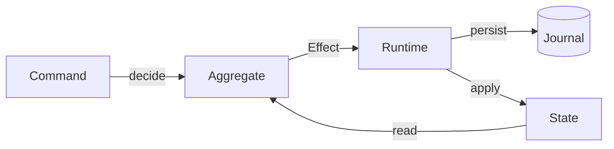
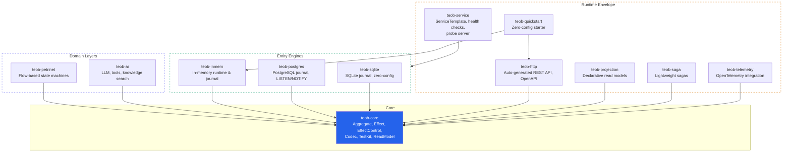
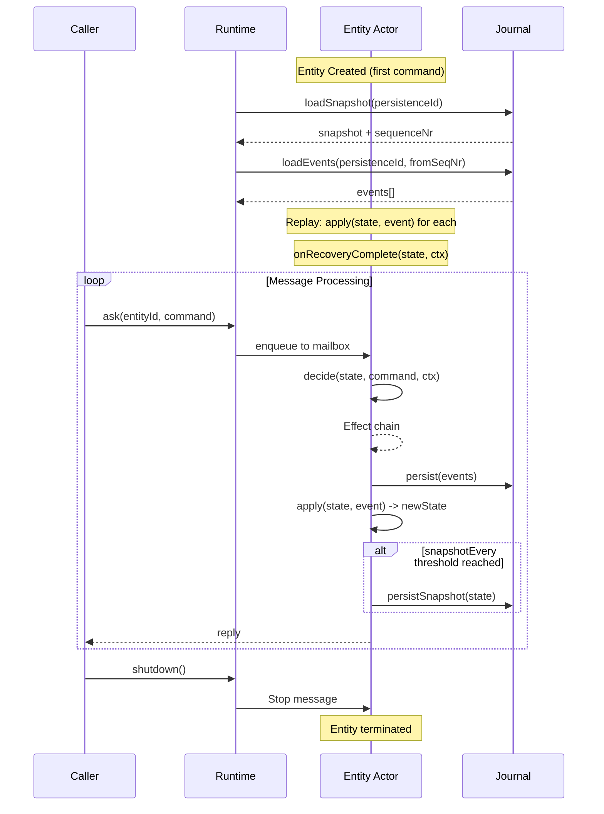
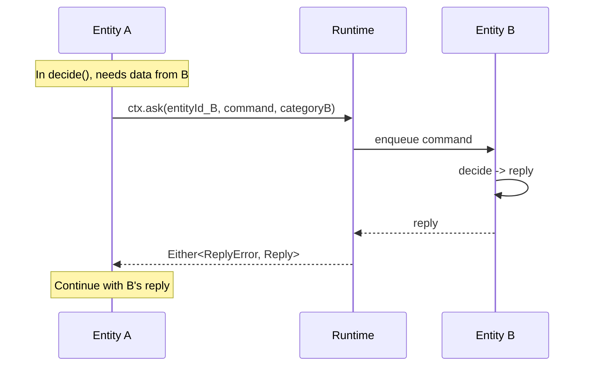

# TEOB-TS

**Type-safe Event-sourcing Over Behaviours**

## What if your backend code had no bugs hiding in mutable state?

Most backend systems share the same DNA: objects that mutate in place, persistence logic tangled into business rules, and state that silently drifts out of sync across services. Bundling persistence with business logic forces ad-hoc caching, introduces locks and contention bottlenecks, and makes the system increasingly fragile as it grows. We've built entire careers around managing this complexity — ORMs, migration scripts, cache invalidation, distributed locks, retry queues, compensating transactions. These aren't features. They're symptoms.

TEOB is a different foundation. It draws on four decades of ideas that have each proven themselves in isolation — and fuses them into a single, coherent programming model where these problems simply don't arise:

- **Domain-Driven Design** — model your stateful services as *aggregates* (self-contained consistency boundaries) that speak the language of the domain, not the database.
- **Event Sourcing** — don't store current state; store the *sequence of facts* that produced it. Every state change is an immutable event appended to a durable log, with ordering guarantees. 
- **CQRS** — separate the write path (state changes) from the read path (projections that query views), so each can be optimized and scaled independently.
- **Actor Model** — each entity runs in its own lightweight process, processing one message at a time from a mailbox. No shared state, no locks, guaranteed linearity, inherently concurrent.
- **Pure Functional Programming** — all business logic are pure functions `(State, Command) → Effect`. Explicit declarative effects, no hidden dependencies, trivially testable

### The core insight

Just four things define an entity in TEOB:

1. **An initial state** — what a new entity looks like
2. **A decision function** — given the current state and a command, return a *description* of what should happen (events to persist, replies to send, side-effects to run)
3. **An applicator** — given the current state and an event, return the next state
4. **A codec** — how to serialize events and state for persistence

That's it. No tens of database calls per request, no N+1 querying. No need for transaction management –                                          aggregate _is_ the transactional boundary.
No framework base classes. Just **pure functions** and **immutable data**. The decision function doesn't *do* anything — it returns a declarative **Effect** that describes what *should* happen. The runtime takes it from there.



### Why this matters

**Integrity without transactions.** Every state change is an immutable event appended to a journal. The current state is always derivable by replaying events. There is no "UPDATE" that silently corrupts a row — if something went wrong, you can see exactly what happened and when.
                                    
**Scalability without distributed locks.** Each entity is an actor — it processes one command at a time against its own private state. No shared mutable state means no contention. Cross-entity communication happens through typed message passing, not shared databases. Scale out by partitioning entities across nodes.

**Complexity without spaghetti.** Business logic is a pure function from `(State, Command) → Effect`. It doesn't import your ORM, your HTTP framework, or your message broker. It doesn't know what database you're using — or if there even is one. You can read an aggregate definition and understand the business rules *completely*, without chasing through layers of infrastructure.

**Testability without infrastructure.** Because aggregates are pure, you can test them by calling `decide()` with a state and a command, then inspecting the returned effects. No test databases. No Docker containers. No mocking frameworks. Your tests run in milliseconds and test exactly the logic that matters.

**AI-native code.** Pure functions operating on typed, immutable data are the ideal surface for AI-assisted development. An LLM can reason about a `decide` function the same way it reasons about a math function — inputs in, outputs out, no hidden side effects. TEOB aggregates are readable, auditable, and generatable by both humans and machines.

### The lineage

TEOB stands on the shoulders of proven ideas — and the battle-tested systems that put them into production:

- **Domain-Driven Design** (Evans, 2003) — Aggregates as consistency boundaries, ubiquitous language, bounded contexts. TEOB's `Aggregate` *is* the DDD aggregate, with commands, events, and invariants as first-class citizens.
- **Event Sourcing** (Young, ~2006) — State is not stored; it is derived from an append-only log of facts. TEOB's journal is that log. Every entity can be reconstructed to any point in time.
- **CQRS** — Command/Query Responsibility Segregation. The write path (`decide`) and the read path (`apply`, read models) are separate by construction, not by convention.
- **The Actor Model** (Hewitt, 1973) — Each entity processes messages sequentially from a mailbox. No shared state, no locks, inherently concurrent. Proven at scale by Erlang/OTP (telecom-grade fault tolerance since the 1980s) and Akka (the JVM actor framework behind Lightbend's ecosystem). Akka Persistence married actors with event sourcing — TEOB's entity lifecycle is a direct descendant of that design.
- **Functional Programming & Effect Systems** — Immutable data, pure functions, algebraic data types, composable effect descriptions. TEOB's declarative `Effect` ADT takes direct inspiration from the Scala ecosystem: ZIO and Cats Effect showed that side effects can be described as values, composed, and interpreted by a runtime — separating *what* a program does from *how* it executes. TEOB applies the same principle to event-sourced entities: `decide()` returns a data structure, and the runtime interprets it.

### In a nutshell

```
Traditional:  Request → Controller → Service → ORM → Database → Response
              (mutable state, implicit side effects, coupled to infrastructure)

TEOB:         Command → decide(state, command) → Effect → Runtime → Journal
              (immutable events, explicit effects, pure logic, pluggable infra)
```

You write the *what* — the domain logic as pure functions. TEOB handles the *how* — persistence, recovery, snapshots, cross-entity messaging, scaling. Swap the runtime from in-memory (for tests) to PostgreSQL (for production) without changing a single line of business logic.

## Package Structure



**Core** — the foundation everything builds on.

| Module | Path | Description |
|--------|------|-------------|
| **teob-core** | `src/core/`, `src/testing/` | Aggregate, Effect, EffectControl, Codec, types, AggregateTestKit, ReadModel |

**Entity Engines** — pluggable persistence backends that run your aggregates.

| Module | Path | Description |
|--------|------|-------------|
| **teob-inmem** | `src/inmem/` | In-memory runtime and journal for testing and development |
| **teob-postgres** | `src/postgres/` | Production persistence with LISTEN/NOTIFY event streaming |
| **teob-sqlite** | `src/sqlite/` | SQLite persistence — zero-config local dev, embedded deployments |

**Runtime Envelope** — HTTP, projections, service lifecycle.

| Module | Path | Description |
|--------|------|-------------|
| **teob-http** | `src/http/` | Auto-generated REST endpoints and OpenAPI schema from aggregates |
| **teob-projection** | `src/projection/` | Declarative read model projections with evolve/initialState pattern |
| **teob-saga** | `src/saga/` | Lightweight event-driven sagas — choreography and orchestration |
| **teob-telemetry** | `src/telemetry/` | OpenTelemetry integration — spans, metrics, instrumented journal |
| **teob-quickstart** | `src/quickstart/` | Zero-config wiring: one function from aggregate to running HTTP API |
| **teob-service** | `src/service/` | Layered startup/shutdown, health checks, HTTP probe server |

**Domain Layers** — higher-level abstractions built on top of core aggregates.

| Module | Path | Description |
|--------|------|-------------|
| **teob-petrinet** | `src/petrinet/` | Flow-based state machines with automatic transition firing |
| **teob-ai** | `src/ai/` | LLM integration, tool system, knowledge search (RAG) |

## Quickstart

From zero to a running event-sourced HTTP API in ~30 lines:

```typescript
import { aggregate, quickstart } from "@lambda-house/teob-ts/quickstart";
import { persist, reply } from "@lambda-house/teob-ts/core";

type Command = { tag: "Increment" } | { tag: "Decrement" } | { tag: "GetCount" };
type Event = { tag: "Incremented" } | { tag: "Decremented" };
type Reply = { tag: "Count"; count: number };
type State = { count: number };

const counter = aggregate<Command, Event, State, Reply>({
  category: "counter",
  initialState: () => ({ count: 0 }),
  decide: async (state, command) => {
    switch (command.tag) {
      case "Increment": return persist({ tag: "Incremented" });
      case "Decrement": return persist({ tag: "Decremented" });
      case "GetCount": return reply({ tag: "Count", count: state.count });
    }
  },
  apply: (state, event) => {
    switch (event.tag) {
      case "Incremented": return { count: state.count + 1 };
      case "Decremented": return { count: state.count - 1 };
    }
  },
});

quickstart({ aggregates: [counter], port: 3000 });
```

```bash
npx tsx examples/quickstart.ts

curl -X POST http://localhost:3000/api/counter/my-counter \
  -H 'Content-Type: application/json' \
  -d '{"tag":"Increment"}'
# → {"tag":"Count","count":1}
```

`quickstart()` auto-derives codecs, creates an in-memory runtime, generates HTTP routes, and starts the server. No Docker, no Postgres, no configuration.

## Manual Setup

For production use, you get full control over codecs, runtime, and HTTP wiring.

### 1. Define Your Domain

All domain types are discriminated unions with a `tag` field:

```typescript
type CounterCommand =
  | { tag: "Increment"; amount: number }
  | { tag: "Decrement"; amount: number }
  | { tag: "GetValue" };

type CounterEvent =
  | { tag: "Incremented"; amount: number }
  | { tag: "Decremented"; amount: number };

type CounterReply =
  | { tag: "Ok" }
  | { tag: "Value"; value: number };

interface CounterState { value: number }
```

### 2. Implement an Aggregate

```typescript
import { CategoryId, EntityId } from "@lambda-house/teob-ts/core";
import { persist, reply, andReply } from "@lambda-house/teob-ts/core";
import { categoryTypes } from "@lambda-house/teob-ts/core";
import type { Aggregate } from "@lambda-house/teob-ts/core";

const counterCategory = categoryTypes<CounterCommand, CounterReply>(
  CategoryId("counter"),
);

const counterAggregate: Aggregate<CounterCommand, CounterReply, CounterEvent, CounterState> = {
  category: CategoryId("counter"),
  initial: (_id) => ({ value: 0 }),

  async decide(state, command, _ctx) {
    switch (command.tag) {
      case "Increment":
        return andReply(
          persist({ tag: "Incremented", amount: command.amount }),
          { tag: "Ok" },
        );
      case "Decrement":
        return andReply(
          persist({ tag: "Decremented", amount: command.amount }),
          { tag: "Ok" },
        );
      case "GetValue":
        return reply({ tag: "Value", value: state.value });
    }
  },

  apply(state, event) {
    switch (event.tag) {
      case "Incremented": return { value: state.value + event.amount };
      case "Decremented": return { value: state.value - event.amount };
    }
  },
};
```

### 3. Create Codecs

```typescript
import { tagCodec, objectCodec } from "@lambda-house/teob-ts/core";

const eventCodec = tagCodec<CounterEvent>("Incremented", "Decremented");
const stateCodec = objectCodec<CounterState>("CounterState");
```

### 4. Run with a Runtime

```typescript
import { createSingleRuntime } from "@lambda-house/teob-ts/inmem";

const { runtime } = createSingleRuntime(counterAggregate, eventCodec, stateCodec);

// Fire-and-forget
await runtime.tell(EntityId("counter-1"), { tag: "Increment", amount: 5 }, counterCategory);

// Request-reply
const result = await runtime.ask(EntityId("counter-1"), { tag: "GetValue" }, counterCategory);
if (result.ok) {
  console.log(result.value); // { tag: "Value", value: 5 }
}

await runtime.shutdown();
```

### 5. Test without a Runtime

```typescript
import { createAggregateTestKit } from "@lambda-house/teob-ts/testing";

const kit = createAggregateTestKit(counterAggregate);
const state = counterAggregate.initial(EntityId("test"));

const { newState, result } = await kit.runAndApply(state, { tag: "Increment", amount: 3 });
expect(newState.value).toBe(3);
expect(result.events).toEqual([{ tag: "Incremented", amount: 3 }]);
expect(result.reply).toEqual({ tag: "Ok" });
```

## HTTP API

Auto-generate typed REST endpoints from your aggregates:

```typescript
import { aggregateRoutes, allAggregateRoutes } from "@lambda-house/teob-ts/http";

// Single aggregate
app.route("/api/counter", aggregateRoutes(runtime, counterCategory));

// Multiple aggregates
app.route("/api", allAggregateRoutes(runtime, [counterCategory, orderCategory]));
```

**Routes generated:** `POST /:category/:entityId` — send a command as JSON body with a `tag` field.

**ETag/If-Match** optimistic concurrency is enabled by default:
- Responses include an `ETag` header (entity sequence number)
- Send `If-Match: "3"` to assert you're updating from a known version
- Returns `409 Conflict` if the version doesn't match

**OpenAPI schema** generation:

```typescript
import { openApiSchema } from "@lambda-house/teob-ts/http";
import { describeAggregate } from "@lambda-house/teob-ts/core";

const descriptions = [
  describeAggregate(counterAggregate, eventCodec, commandCodec, replyCodec),
];
const spec = openApiSchema(descriptions);
// → OpenAPI 3.1 JSON with schemas derived from your command/reply types
```

## Declarative Projections

Build read models with the same `evolve` pattern as aggregate `apply`:

```typescript
import { projection, createInMemoryProjectionStore, runProjection } from "@lambda-house/teob-ts/projection";

const orderSummary = projection({
  projectionId: "order-summary",
  category: "order",
  evolve: (view, event) => {
    switch (event.tag) {
      case "OrderPlaced": return { ...view, status: "placed", total: event.total };
      case "OrderShipped": return { ...view, status: "shipped", trackingId: event.trackingId };
      default: return view;
    }
  },
  initialState: () => ({ status: "draft", total: 0, trackingId: undefined }),
});

const store = createInMemoryProjectionStore();
runProjection(orderSummary, journal, store);

// Query
const view = store.get("order-summary", "order-1");
```

**Multi-stream projections** aggregate events from multiple categories into shared views:

```typescript
const customerDashboard = projection({
  projectionId: "customer-dashboard",
  sources: [
    { category: "order", getViewId: (event) => event.customerId },
    { category: "payment", getViewId: (event) => event.customerId },
  ],
  evolve: (view, event) => {
    switch (event.tag) {
      case "OrderPlaced": return { ...view, orderCount: view.orderCount + 1 };
      case "PaymentReceived": return { ...view, totalPaid: view.totalPaid + event.amount };
      default: return view;
    }
  },
  initialState: () => ({ orderCount: 0, totalPaid: 0 }),
});
```

Projections are **resumable** (only process new events on subsequent runs) and support **rebuild** from scratch via `rebuildProjection()`.

For persistent projection stores, use `createSqliteProjectionStore(db)` with a better-sqlite3 database instance.

## Lightweight Sagas

React to events with cross-entity command dispatch:

```typescript
import { saga, runSaga, createInMemorySagaStore } from "@lambda-house/teob-ts/saga";

const paymentOnOrder = saga({
  name: "payment-on-order",
  on: "OrderPlaced",
  from: "order",
  execute: async (event, entityId, ctx) => {
    await ctx.tell(EntityId(event.paymentId), {
      tag: "ChargeCard",
      amount: event.total,
    }, paymentCategory);
  },
});

const store = createInMemorySagaStore();
await runSaga(paymentOnOrder, journal, runtime, store);
```

**Stateful sagas** for multi-step orchestration with compensation:

```typescript
import { statefulSaga, runStatefulSaga } from "@lambda-house/teob-ts/saga";

const fulfillment = statefulSaga({
  name: "fulfillment",
  steps: [
    { on: "OrderPlaced", from: "order", execute: async (event, _, ctx) => {
      await ctx.tell(inventoryId, { tag: "ReserveItems", items: event.items }, inventoryCategory);
    }},
    { on: "ItemsReserved", from: "inventory", execute: async (event, _, ctx) => {
      await ctx.tell(shippingId, { tag: "CreateShipment" }, shippingCategory);
    }},
  ],
  compensate: async (failedStep, event, _, ctx) => {
    if (failedStep >= 1) {
      await ctx.tell(inventoryId, { tag: "ReleaseItems" }, inventoryCategory);
    }
  },
});
```

## SQLite Backend

Zero-config persistence — no Docker, no Postgres:

```typescript
import { createSqliteRuntime, registration } from "@lambda-house/teob-ts/sqlite";

const { runtime, journal } = createSqliteRuntime(
  { path: "./data/journal.db" },  // or ":memory:" for tests
  [registration(myAggregate, eventCodec, stateCodec)],
);

// Same API as inmem and postgres runtimes
await runtime.ask(EntityId("e1"), { tag: "DoSomething" }, myCategory);
```

SQLite runtime supports WAL mode (default), snapshots, and full recovery from disk. Use it for local development, embedded deployments, or faster CI runs.

## OpenTelemetry

Instrument your runtime with zero-config OpenTelemetry support:

```typescript
import { withTelemetry, withJournalTelemetry } from "@lambda-house/teob-ts/telemetry";

// Wrap runtime — adds command spans, counters, duration histograms
const instrumentedRuntime = withTelemetry(runtime);

// Wrap journal — adds persist/load spans, events persisted counter
const instrumentedJournal = withJournalTelemetry(journal);
```

If `@opentelemetry/api` is not installed, all instrumentation is no-op with zero overhead.

## AI Agent Flow

Build crash-resilient LLM agent loops as event-sourced aggregates:

```typescript
import { agentFlowAggregate } from "@lambda-house/teob-ts/ai";

const agent = agentFlowAggregate<MyState>({
  config: { model: "gpt-4o", maxToolRounds: 5, maxRetries: 3 },
  llmService,
  toolRegistry,
  stateSchema: {
    initial: (id) => ({ history: [] }),
    encode: (s) => s,
    decode: (j) => j as MyState,
  },
  contextBuilder: {
    buildContext: async (input, state, messages, tools) => [
      { role: "system", content: "You are a helpful assistant." },
      ...messages,
    ],
  },
  responseHandler: {
    parseAndApply: async (state, response) => ({
      state: { ...state, lastResponse: response },
      explanation: response,
      isDone: true,
    }),
  },
});
```

The self-command loop (`ProcessInput → LLM → ToolCalls → ToolResults → LLM → ...`) is fully event-sourced — every LLM invocation, tool execution, and state mutation is persisted as an event. Crash recovery replays the events and resumes from where it left off.

## Agent Memory

Cross-session memory backed by knowledge search:

```typescript
import { createKnowledgeBackedMemoryService, createMemoryTool } from "@lambda-house/teob-ts/ai";

const memory = createKnowledgeBackedMemoryService(knowledgeAPI);

// Store
await memory.store("agent-1", "user", "User prefers dark mode");

// Recall (with semantic search)
const memories = await memory.recall({ agentId: "agent-1", semanticQuery: "UI preferences" });

// As an MCP tool for LLM agents
const memoryTool = createMemoryTool(memory, "agent-1");
toolRegistry.register(memoryTool);
```

## Tool Permissions

Control tool execution with approval workflows:

```typescript
import { ToolPermission } from "@lambda-house/teob-ts/ai";

const dangerousTool: MCPTool = {
  name: "delete-record",
  description: "Delete a database record",
  inputSchema: { /* ... */ },
  permission: ToolPermission.Confirm,  // Always ask for approval
  execute: async (input) => { /* ... */ },
};

const expensiveTool: MCPTool = {
  name: "send-email",
  permission: ToolPermission.ConfirmIf("recipients > 10"),  // Only ask if sending to many
  // ...
};

// Registry with approval callback
const registry = createMCPToolRegistry(async (toolName, args) => {
  return await askUserForApproval(toolName, args);
});
```

## Event Upcasting

Evolve event schemas over time without breaking existing data:

```typescript
import { upcast, codecWithUpcasts, tagCodec } from "@lambda-house/teob-ts/core";

// Base codec for current event version
const baseCodec = tagCodec<OrderEvent>("OrderPlaced", "OrderCancelled");

// Add upcast chain for schema evolution
const orderCodec = codecWithUpcasts(baseCodec, [
  // V1 → V2: add currency field with default
  upcast("OrderPlacedV1", "OrderPlacedV2", (old) => ({
    ...old,
    currency: old.currency ?? "USD",
  })),
  // V2 → V3: add region field
  upcast("OrderPlacedV2", "OrderPlaced", (old) => ({
    ...old,
    region: old.region ?? "US",
  })),
]);
```

Events are stored as-is (original version). Upcasts are applied on read, so old events are transparently migrated to the current schema. Chains are applied in sequence: V1 → V2 → V3.

In-place evolution (same manifest, add defaults) works too:

```typescript
upcast("OrderPlaced", "OrderPlaced", (old) => ({
  ...old,
  currency: old.currency ?? "USD",
}));
```

## Entity Lifecycle



## Cross-Entity Communication

Entities communicate via `EffectControl` with compile-time type safety through `CategoryRegistration`:



```typescript
// Define B's category registration (type-safe handle)
const orderCategory = categoryTypes<OrderCommand, OrderReply>(CategoryId("order"));

// In Entity A's decide function:
async decide(state, command, ctx) {
  const result = await ctx.ask(EntityId("order-123"), { tag: "GetStatus" }, orderCategory);
  if (result.ok) {
    // result.value is typed as OrderReply
  }
}
```

## Further Reading

- [Core Reference](docs/core.md) — Aggregate, Effect ADT, EffectControl, Codec, ReadModel, AggregateTestKit
- [In-Memory Runtime](docs/inmem.md) — Actor model, mailbox, entity lifecycle
- [PostgreSQL Runtime](docs/postgres.md) — Journal schema, LISTEN/NOTIFY, configuration
- [Service Lifecycle](docs/service.md) — Layered startup/shutdown, health checks, probe server
- [Petri Net Flows](docs/petrinet.md) — Flow modeling, transition lifecycle, TEOB integration
- [AI Integration](docs/ai.md) — LLM, embeddings, knowledge search, agent runner

## License

MIT
