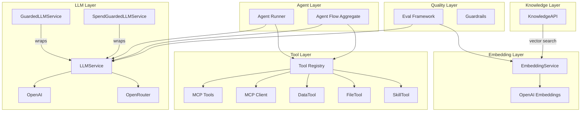

# teob-ai

Provider-agnostic AI integration for the TEOB framework. Provides LLM chat, tool calling, embeddings, RAG-based knowledge search, guardrails, evaluation, streaming, cost tracking, and more.

**Standalone module** — no TEOB core dependency.

```typescript
import { createOpenAILLMService, createMCPToolRegistry } from "teob-ts/ai";
```

```
src/ai/
├── llm/
│   ├── llm-service.ts             — LLMService interface (chat, tracked, streaming)
│   ├── types.ts                   — ChatMessage, LLMTool, ModelConfig, LLMUsage, LLMCost, CostModel, LLMStreamChunk
│   ├── openai-llm-service.ts      — OpenAI backend (with streaming + tracked)
│   ├── openrouter-llm-service.ts  — OpenRouter backend
│   ├── stream-accumulator.ts      — collectStream: async iterable → LLMResult
│   └── spend-guarded-llm-service.ts — Budget enforcement decorator
├── embedding/
│   ├── embedding-service.ts       — EmbeddingService interface
│   └── openai-embedding-service.ts — OpenAI embeddings
├── knowledge/
│   ├── knowledge-api.ts           — KnowledgeAPI (RAG)
│   └── knowledge-search-tool.ts   — KnowledgeSearchTool (MCP tool bridge)
├── memory/
│   ├── memory-service.ts          — MemoryService interface
│   ├── knowledge-backed-memory-service.ts — KnowledgeAPI-backed implementation
│   └── memory-tool.ts             — MCP tool for memory operations
├── agent/
│   ├── types.ts                   — Agent runner protocol (REST/WebSocket)
│   └── agent-runner-client.ts     — AgentRunnerClient implementation
├── agent-flow/                    — Crash-resilient LLM agent aggregate
├── tool/
│   ├── types.ts                   — MCPTool, MCPToolCall, MCPToolResult, ToolPermission
│   ├── mcp-tool-registry.ts       — In-memory tool registry with permissions
│   └── mcp/                       — MCP Client for external servers
│       ├── protocol.ts            — JSON-RPC 2.0 types
│       ├── transport.ts           — MCPTransport interface
│       ├── stdio-transport.ts     — Child process transport
│       ├── http-sse-transport.ts  — HTTP+SSE transport
│       └── mcp-client.ts          — MCPClient (initialize, listTools, callTool, registerAll)
├── guardrail/
│   ├── types.ts                   — Guardrail, GuardrailResult, Direction
│   ├── guardrails.ts              — KeywordBlocklist, RegexPolicy, LengthLimit, LLMPolicy
│   ├── guardrail-chain.ts         — Sequential composition (short-circuit or collect-all)
│   └── guarded-llm-service.ts     — LLMService decorator with input/output guardrails
├── eval/
│   ├── types.ts                   — EvalInput, EvalScore, Evaluator, EvalDataset, EvalReport
│   ├── evaluators.ts              — 7 built-in evaluators
│   └── eval-runner.ts             — evaluateSample, evaluateDataset
├── prompt/
│   ├── types.ts                   — PromptVersion, VersionedPromptSection, PromptRegistry
│   └── prompt-registry.ts         — In-memory registry with version lineage + {{variable}} templates
├── data/
│   ├── tabular-store.ts           — TabularStore interface (query, append, update, delete)
│   ├── in-memory-tabular-store.ts — In-memory implementation with filter operators
│   └── data-tool.ts               — MCP tool for structured data access
├── file/
│   ├── file-store.ts              — FileStore interface + FileToolConfig
│   ├── in-memory-file-store.ts    — In-memory implementation
│   ├── local-file-store.ts        — Filesystem with path jail + safety limits
│   └── file-tool.ts               — MCP tool (read/write/list/parse_csv/parse_json/to_csv/markdown_to_html)
├── skill/
│   ├── types.ts                   — SkillDefinition, SkillStore
│   ├── skill-markdown-parser.ts   — Parse SKILL.md files (YAML frontmatter + markdown body)
│   ├── skill-store.ts             — In-memory skill store
│   └── skill-tool.ts              — MCP tool for on-demand skill retrieval + summary builder
├── capability/                    — Self-evolving learned-knowledge model (Capability + CapabilityService)
├── sandbox/                       — Live/Replay/Simulated agent runs + run-level evaluators
└── node-flow/                     — DAG-based flow executor + 19 node kinds + projections
```

---

## Architecture



---

## LLMService

Provider-agnostic interface for LLM interactions:

```typescript
interface LLMService {
  /** Simple chat completion. */
  chat(messages: ChatMessage[], jsonMode?: boolean): Promise<string>;

  /** Chat with structured JSON output. */
  chatJson<A>(messages: ChatMessage[], parse?: (raw: unknown) => A): Promise<A>;

  /** Chat with tool calling support (agentic loop). */
  chatWithTools(messages: unknown[], tools: LLMTool[], responseSchema?: ResponseSchema, config?: ModelConfig): Promise<LLMToolResponse>;

  /** Chat with usage metadata (tokens, cost, latency). */
  chatTracked(messages: ChatMessage[], jsonMode?: boolean): Promise<LLMResult<string>>;

  /** Chat with tools + usage metadata. */
  chatWithToolsTracked(messages: unknown[], tools: LLMTool[], responseSchema?: ResponseSchema, config?: ModelConfig): Promise<LLMResult<LLMToolResponse>>;

  /** Streaming chat — emits chunks as they arrive from the LLM. */
  chatStream(messages: unknown[], tools: LLMTool[], responseSchema?: ResponseSchema, config?: ModelConfig): AsyncIterable<LLMStreamChunk>;
}
```

### Streaming

```typescript
type LLMStreamChunk =
  | { tag: "ContentDelta"; text: string }
  | { tag: "ToolCallDelta"; index: number; id?: string; name?: string; argumentsDelta: string }
  | { tag: "Done"; meta: LLMResponseMeta };

// Collect an async iterable of chunks into a complete result
import { collectStream } from "teob-ts/ai";
const result: LLMResult<LLMToolResponse> = await collectStream(llm.chatStream(messages, tools));
```

### Token & Cost Tracking

```typescript
interface LLMUsage { promptTokens: number; completionTokens: number; totalTokens: number; }
interface LLMCost { inputCostUsd: number; outputCostUsd: number; totalCostUsd: number; }
interface LLMResponseMeta { responseId: string; model: string; usage: LLMUsage; cost?: LLMCost; finishReason?: string; latencyMs: number; }
interface LLMResult<A> { value: A; meta: LLMResponseMeta; }
```

### CostModel

```typescript
// Pricing table: model → [input$/M tokens, output$/M tokens]
const costModel = CostModel.fromPricing({
  "gpt-4o": [5.0, 15.0],
  "gpt-4o-mini": [0.15, 0.6],
});

const llm = createOpenAILLMService({ apiKey: "sk-...", costModel });
const result = await llm.chatTracked([ChatMessage.user("Hello")]);
console.log(result.meta.cost); // { inputCostUsd: 0.001, outputCostUsd: 0.003, totalCostUsd: 0.004 }
```

### SpendGuardedLLMService

Budget enforcement across a sequence of calls:

```typescript
import { createSpendGuardedLLMService, SpendLimitExceeded } from "teob-ts/ai";

const guarded = createSpendGuardedLLMService(llm, {
  maxTotalCostUsd: 1.0,
  maxTotalTokens: 100_000,
});

await guarded.chatTracked(messages); // tracked calls update spend state
guarded.getSpendState(); // { totalCostUsd, totalTokens, callCount }
// Throws SpendLimitExceeded when budget exceeded
```

### Backends

```typescript
const llm = createOpenAILLMService({ apiKey: "sk-...", model: "gpt-4o-mini", costModel });
const llm = createOpenRouterLLMService({ apiKey: "sk-or-...", model: "anthropic/claude-sonnet-4" });
```

---

## Guardrails

Policy-based content safety on LLM I/O:

```typescript
import { keywordBlocklist, regexPolicy, lengthLimit, llmPolicy, guardrailChain, createGuardedLLMService } from "teob-ts/ai";

// Built-in policies
const inputGuards = guardrailChain([
  keywordBlocklist(["password", "secret"]),
  regexPolicy(/\d{3}-\d{2}-\d{4}/, "SSN"),
  lengthLimit(10_000, "block"),
]);

const outputGuards = guardrailChain([
  keywordBlocklist(["confidential"]),
  llmPolicy(llm, "Response must not contain financial advice"),
]);

// Wrap LLMService with guardrails
const safe = createGuardedLLMService(llm, [inputGuards], [outputGuards]);
// Throws GuardrailBlocked on policy violation
```

---

## Evaluation Framework

Quantitative and qualitative assessment of LLM outputs:

```typescript
import { exactMatch, contains, jsonValid, regexMatch, lengthCheck, evaluateDataset } from "teob-ts/ai";

const evaluators = [exactMatch(), contains(["important", "keywords"]), jsonValid()];

const report = await evaluateDataset(
  { name: "qa", version: "1.0", samples: [{ id: "s1", prompt: "What is 2+2?", expectedOutput: "4" }] },
  async (prompt) => await llm.chat([ChatMessage.user(prompt)]),
  evaluators,
);
// report.aggregates[0].mean → average score across dataset
```

**7 built-in evaluators:** ExactMatch, Contains, JsonValid, RegexMatch, CosineSimilarity, LLMJudge, LengthCheck.

---

## MCP Client

Connect to external MCP servers (Claude Code, custom tools):

```typescript
import { createStdioTransport, createHttpSseTransport, createMCPClient } from "teob-ts/ai";

// Stdio: spawn a child process
const transport = createStdioTransport("npx", ["-y", "@modelcontextprotocol/server-filesystem"]);
// HTTP: connect to a running server
const transport = createHttpSseTransport("http://localhost:8080/mcp");

const client = createMCPClient(transport);
await client.initialize();
const tools = await client.listTools();
await client.registerAll(registry); // register remote tools into local registry
const result = await client.callTool("search", { query: "hello" });
```

---

## Prompt Versioning

Versioned prompts with lineage and template substitution:

```typescript
import { createInMemoryPromptRegistry } from "teob-ts/ai";

const prompts = createInMemoryPromptRegistry();
const v1 = await prompts.create("greeting", [
  { tag: "role", content: "You are a {{role}}.", priority: 1 },
  { tag: "task", content: "Help with {{topic}}.", priority: 2 },
]);
const v2 = await prompts.update("greeting", [/* updated sections */]);
// v2.parentVersionId === v1.versionId

const { rendered, versionId } = await prompts.resolve("greeting", { role: "teacher", topic: "math" });
// "You are a teacher.\n\nHelp with math."
```

---

## Tabular Data Store

Row-based structured data (complements vector search):

```typescript
import { createInMemoryTabularStore, createDataTool } from "teob-ts/ai";

const store = createInMemoryTabularStore();
await store.append("users", { name: "Alice", age: 30 });
const rows = await store.query("users", { conditions: [{ column: "age", op: "gt", value: 25 }] });

// MCP tool for LLM access
const tool = createDataTool({ main: store });
registry.register(tool);
```

**Filter operators:** eq, neq, gt, lt, gte, lte, contains, in.

---

## File Store

Filesystem abstraction with safety limits:

```typescript
import { createLocalFileStore, createInMemoryFileStore, createFileTool } from "teob-ts/ai";

const store = createLocalFileStore("/data", { maxReadBytes: 1_000_000, denyPatterns: [/\.env/] });
const content = await store.read("report.txt");

// MCP tool with built-in transformations
const tool = createFileTool(store);
// Actions: read, write, list, info, parse_csv, parse_json, to_csv, markdown_to_html
```

---

## Skills System

Reusable behavioral units following the Anthropic SKILL.md standard:

```typescript
import { parseSkillMarkdown, createInMemorySkillStore, createSkillTool, buildSkillSummary } from "teob-ts/ai";

// Parse a SKILL.md file
const { name, definition } = parseSkillMarkdown("greeting.skill.md", fileContent);

// Store and retrieve skills
const store = createInMemorySkillStore();
store.add(name, definition);

// Two-tier delivery:
// 1. Summary in system prompt (lightweight)
const summary = await buildSkillSummary(store);
// 2. Full content via MCP tool (on demand)
const tool = createSkillTool(store);
registry.register(tool);
```

### SKILL.md Format

```markdown
---
name: objection-price
description: "Techniques for handling price objections"
when-to-use: "When customer raises price concerns"
allowed-tools: [knowledge_search]
arguments: [objection_type]
version: "1.0"
---

## Instructions here...
```

---

## EmbeddingService

Vector embedding for semantic search:

```typescript
interface EmbeddingService {
  embed(text: string): Promise<number[]>;
}

const embedding = createOpenAIEmbeddingService({ apiKey: "sk-...", model: "text-embedding-3-small" });
const vector = await embedding.embed("TEOB event sourcing");
```

---

## KnowledgeAPI (RAG)

Collection-based knowledge store with hybrid vector + text search:

```typescript
interface KnowledgeAPI {
  findBestMatches(userQuery: string, filter?: KnowledgeFilter, limit?: number, similarityThreshold?: number, vectorWeight?: number, textWeight?: number): Promise<KnowledgeRecord[]>;
  viewRecords(filter?: KnowledgeFilter, exactWord?: string, limit?: number): Promise<KnowledgeRecord[]>;
  upsertRecord(record: KnowledgeRecordInput): Promise<KnowledgeRecord>;
  deleteRecord(id: string): Promise<boolean>;
  deleteCollection(collection: string): Promise<number>;
  exportCollection(collection: string): Promise<KnowledgeRecordExport[]>;
  importRecords(records: KnowledgeRecordExport[], computeVectors: boolean): Promise<[number, number]>;
  recomputeVector(id: string): Promise<KnowledgeRecord | undefined>;
}
```

---

## Memory Service

Cross-session, typed, scope-isolated memory backed by KnowledgeAPI:

```typescript
interface MemoryService {
  store(agentId: string, memoryType: MemoryType, content: string, metadata?: Record<string, string>): Promise<Memory>;
  recall(query: MemoryQuery): Promise<Memory[]>;
  update(id: string, content: string): Promise<Memory>;
  forget(id: string): Promise<void>;
}
// MemoryType: "user" | "feedback" | "domain" | "reference"
```

---

## Tool System

### MCPTool + Registry

```typescript
import { createMCPToolRegistry } from "teob-ts/ai";

const registry = createMCPToolRegistry(approvalCallback);
registry.register({ name: "lookup", description: "...", inputSchema: {...}, permission: ToolPermission.ConfirmIf("amount > 100"), execute: async (input) => MCPToolResult.success(data) });
const result = await registry.execute({ name: "lookup", arguments: { id: "42" } });
```

### Permission Model

```typescript
type ToolPermission =
  | { tag: "Auto" }          // Always execute
  | { tag: "Confirm" }       // Always require approval
  | { tag: "ConfirmIf"; condition: string }; // Conditional: "amount > 100"
```

---

## Agent Runner

WebSocket-based agent execution protocol:

```typescript
const client = createAgentRunnerClient("http://localhost:3100");
const { id } = await client.createSession({ prompt: "Help me with..." });
const session = await client.connectSession(id);
for await (const msg of session.messages) { /* stream response */ }
```

---

## Agent Flow Aggregate

Crash-resilient LLM agent as a TEOB aggregate. See `src/ai/agent-flow/` for the full agentic loop with multi-round tool execution, exponential backoff retry, and metrics tracking.

---

## Sandbox Framework

Three-mode (Live / Replay / Simulated) sandbox for agent runs. Captures LLM + tool interactions, replays them deterministically, or simulates tools with pure functions. Adds run-level evaluators on top of `ai/eval/`.

```typescript
import {
  Sandbox,
} from "teob-ts/ai";

const runner = new Sandbox.SandboxBuilder()
  .withAgentLoop({
    async run(llm, tools, instruction) {
      await llm.chat([{ role: "user", content: instruction }]);
      await tools.execute({ name: "search", arguments: { q: "x" } });
      return { finalState: { done: true } };
    },
  })
  .withLLM(llm)
  .withTools(toolRegistry)
  .withConfig({ model: "gpt-4o", provider: "openai", temperature: 0, maxTokens: 1000 })
  .addEvaluator(Sandbox.OutcomeEvaluator())
  .addEvaluator(Sandbox.EfficiencyEvaluator(2000))
  .build();

// Live mode — wraps real services with recording decorators
const live = await runner.runScenario(scenario, { kind: "live" });

// Replay mode — re-runs the agent against a previously captured recording
const replay = await runner.runScenario(scenario, { kind: "replay", recording: live.recording });

// Simulated mode — uses scenario.toolSimulations for deterministic tool responses
const sim = await runner.runScenario({ ...scenario, toolSimulations: new Map(...) }, { kind: "simulated" });
```

**Modes**

| Mode | LLM | Tools | Use case |
|---|---|---|---|
| `live` | real | real | Capture a baseline run for later replay |
| `replay` | recorded responses, in order | recorded results, in order | Determinism check against drift |
| `simulated` | real LLM | pure functions from `Scenario` | Free, repeatable testing without external services |

**Run evaluators** (`Sandbox.*Evaluator`) — score a full recording, in contrast to `ai/eval/` which scores per-sample:

| Evaluator | Score |
|---|---|
| `EfficiencyEvaluator(budget)` | `max(0, 1 - tokens / budget)` |
| `ToolUsageEvaluator()` | `mustUseTools` / `mustNotUseTools` constraints |
| `OutcomeEvaluator()` | 1 if `finalStatePredicate` passes |
| `CustomChecksEvaluator()` | passing checks / total |
| `LLMCallBudgetEvaluator(max)` | linear degradation past `maxLLMCalls` |

`Sandbox.RunComparison.compare(a, b)` produces a `DriftReport` flagging the first divergent step between two recordings.

---

## Capability Model

Unified type for what an agent has *learned* — observations, patterns, principles, heuristics, procedures — with confidence/maturity/provenance signals.

```typescript
import { Capability } from "teob-ts/ai";

const store = new Capability.InMemoryCapabilityStore();
const decider = new Capability.RuleBasedDecider();
const service = new Capability.CapabilityService({ store, decider });

const decision = await service.processObservation({
  scopeKey: "sre-agent",
  content: "When DB latency exceeds 200ms the saga retries",
  source: { kind: "agent_observation", agentId: "sre-agent", roundId: "r1" },
});
// decision: { kind: "add" | "strengthen" | "revise" | "noop"; ... }
```

**Layers** (`Capability.CapabilityLayer`): `experience` → `pattern` → `principle` → `heuristic` → `procedure`.

**Maturity** (`Capability.Maturity`): `observed` → `recurring` → `reliable` → `foundational`. Auto-promotes by evidence count: 2 ⇒ recurring, 4 ⇒ reliable. Foundational is human-only.

**Optics** (`Capability.CapabilityOptics`): `strengthen(ev, now)`, `revise(content, now)`, `promote(to, now)`, `retire(now)`. Pure transformations; `revise` throws `CapabilityImmutableError` on `human_authored` sources.

The in-memory store ranks similarity by Jaccard over keyword sets — fine for tests/demos. Real deployments should back this with pgvector.

---

## NodeFlow (DAG-based flow)

Imperative DAG flow executor, distinct from the Petri net token model. When a node's deps are satisfied, it fires; when terminals are done, the flow completes.

```typescript
import { NodeFlow } from "teob-ts/ai";

const def: NodeFlow.NodeFlowDef = {
  id: "research-flow",
  description: "search → summarize",
  nodes: new Map([
    ["search", { kind: "mcp_tool_exec", toolName: "web_search",
                 inputMapping: { query: "q" }, outputMapping: { results: "$.hits" },
                 errorPolicy: { kind: "fail_flow" } }],
    ["summarize", { kind: "llm_call", userPromptTemplate: "Summarize: {{results}}",
                    tools: [], maxToolIterations: 0,
                    modelConfig: { model: "gpt-4o" }, responseMapping: { summary: "$.summary" } }],
  ]),
  edges: [["search", "summarize"]],
  tags: new Set(),
  initialContext: { q: "TEOB framework" },
  trigger: { kind: "manual" },
};

const aggregate = NodeFlow.createNodeFlowAggregate({
  buildExecCtx: (state) => ({ flowState: state.context, llm, tools }),
});
```

**19 node kinds** declared in `NodeFlow.NodeDef`: `attribute_op`, `branch`, `delay`, `wait_until`, `http_call`, `mcp_tool_exec`, `knowledge_lookup`, `llm_call`, `llm_extract`, `merge`, `verify`, `plan`, `send_message`, `receive_message`, `human_approval`, `user_choice`, `sub_flow_start`, `sub_flow_join`, `poll_until`. Blocking nodes (`receive_message`, `human_approval`, `user_choice`) wait for an external command (`user_message`, `user_choice_response`).

**Templating** — `{{var}}` variables in `urlTemplate` / `userPromptTemplate` / `contentTemplate` are rendered against the flow's context via `NodeFlow.renderTemplate`.

**Guards** (`NodeFlow.Guard`) — typed predicates (`eq`, `neq`, `gt`, `gte`, `lt`, `lte`, `contains`, plus `and`/`or`/`not`/`always`) used by `branch` nodes and trigger gates.

**Compile-time validation** — `NodeFlow.compile(def)` rejects cycles and dangling edges, computes root/terminal sets and dependency maps.

**Self-inspect tool** — `NodeFlow.createSelfInspectTool({...})` registers an MCP tool the LLM can call to introspect its own runtime: `query: 'tools' | 'flows' | 'state' | 'attributes' | 'capabilities'`.

**Projection** — `NodeFlow.projectLLMUsage(events)` folds `node_succeeded` events into an `LLMUsageView` (tokens, calls, latency, by-model breakdowns).

**JSON codec** — `NodeFlow.encodeFlowDef` / `decodeFlowDef` round-trips definitions to wire-compatible JSON (sets become arrays, branch maps become tuples).
