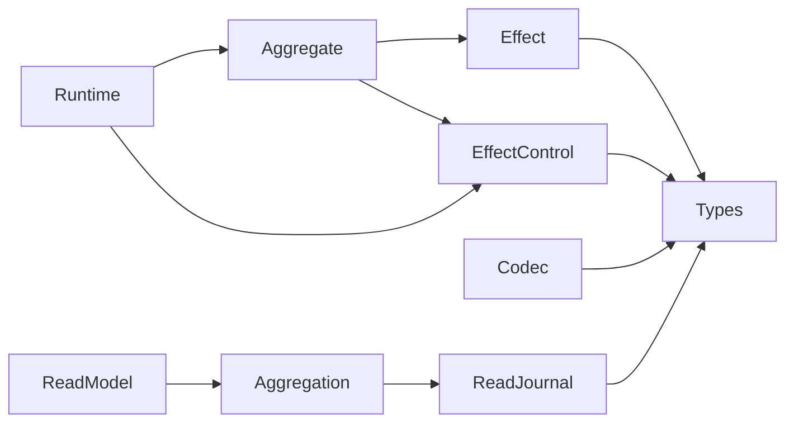
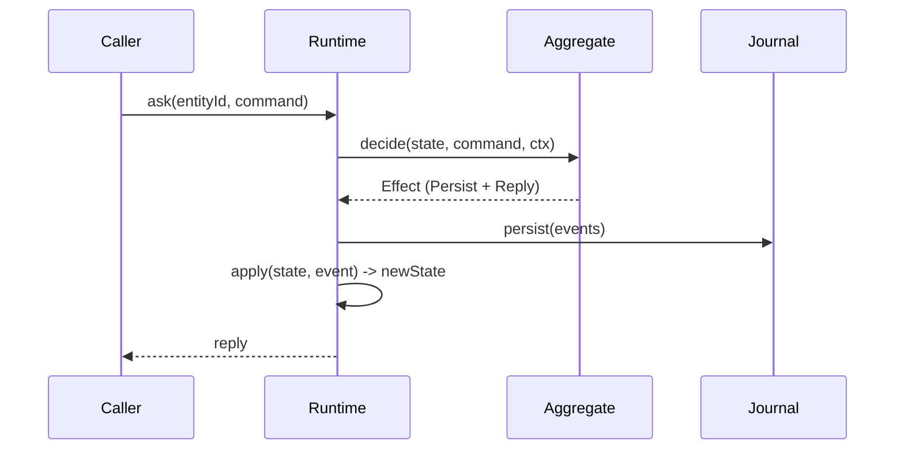
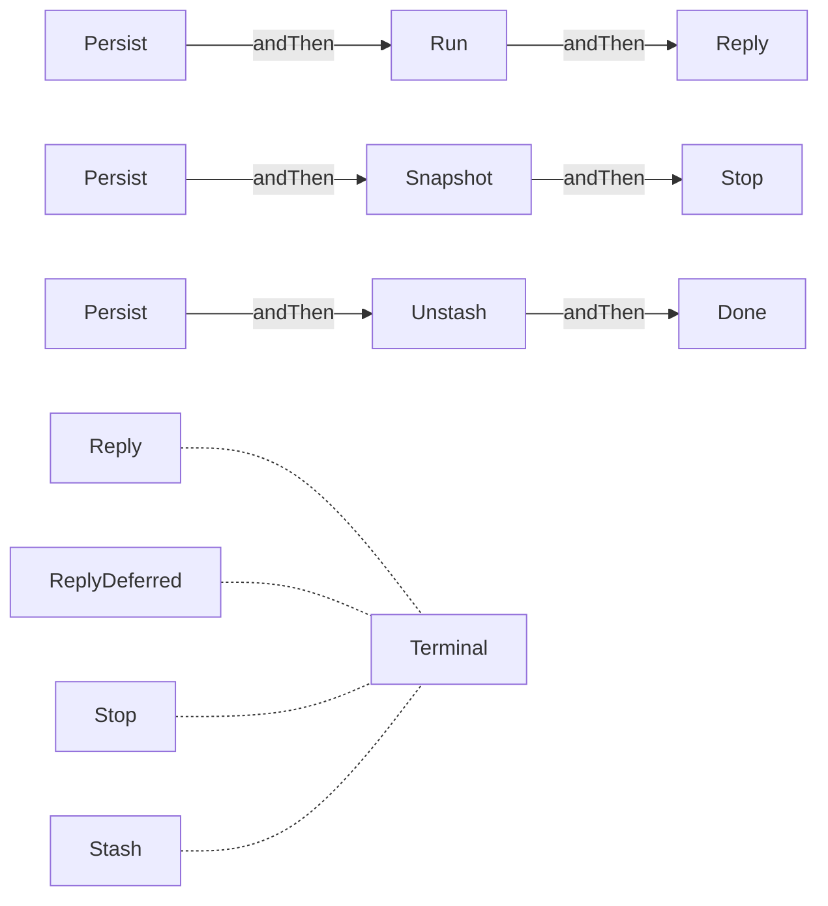
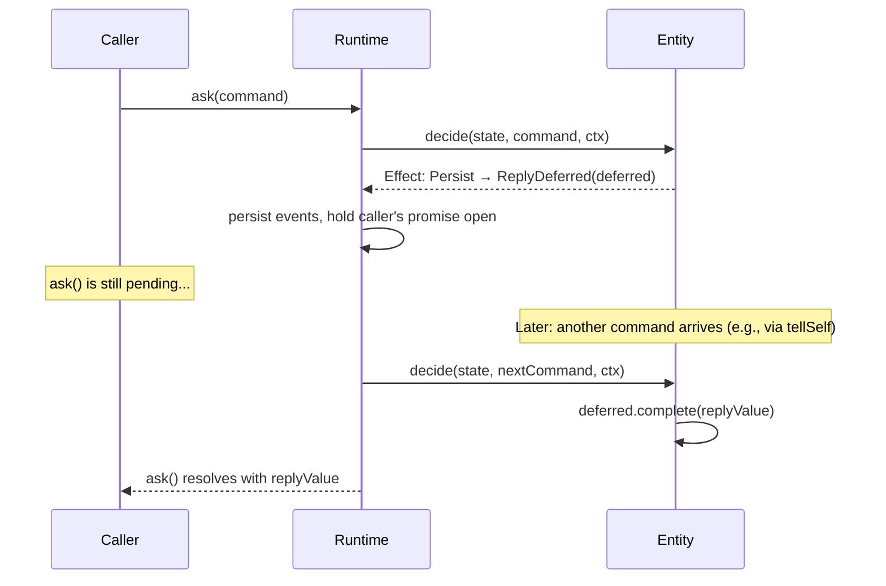
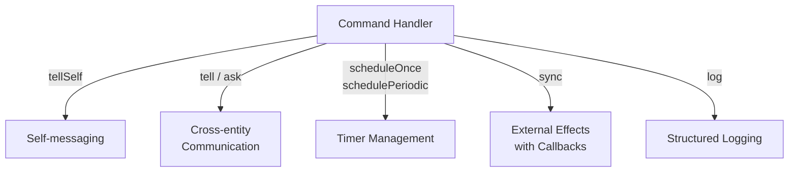
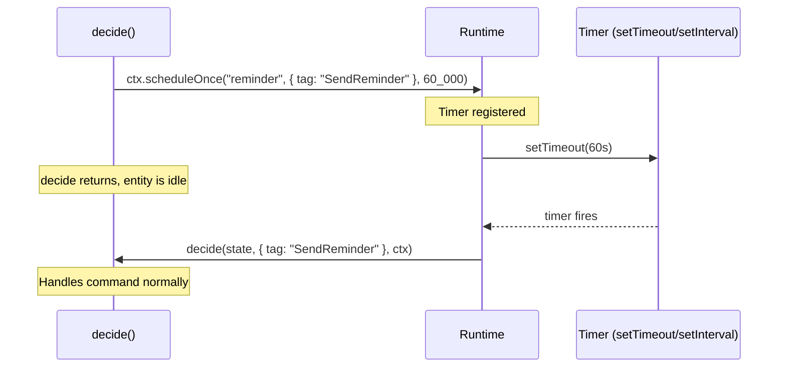
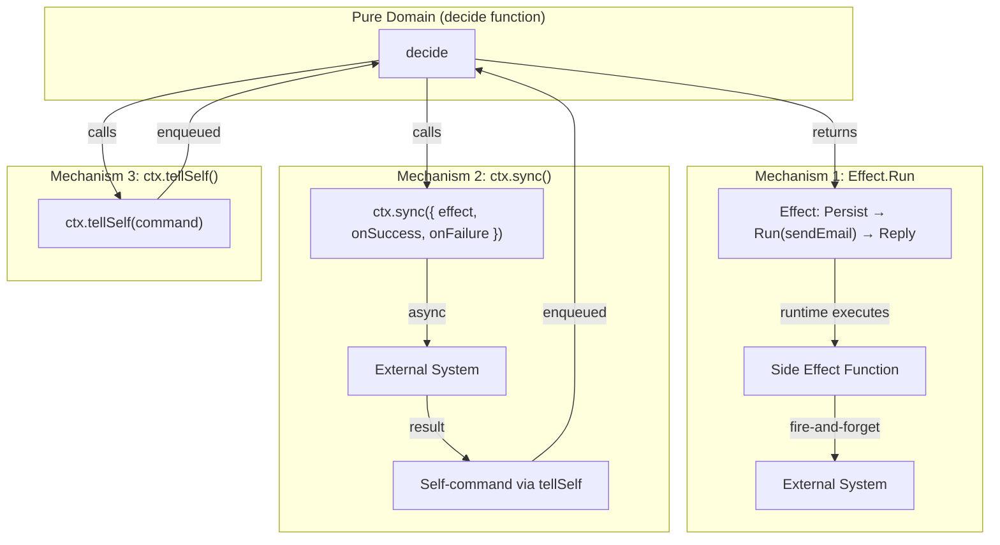
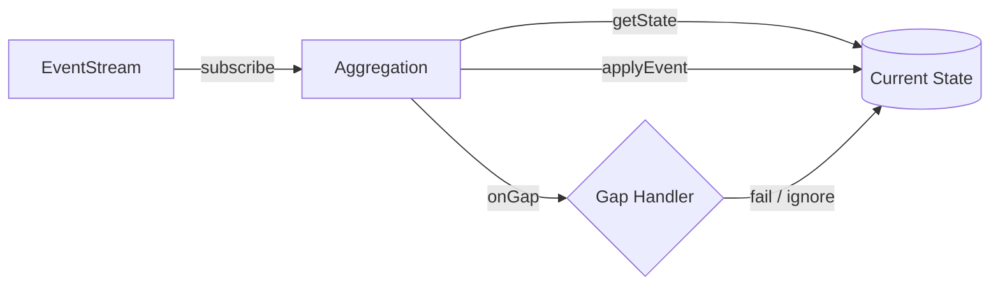
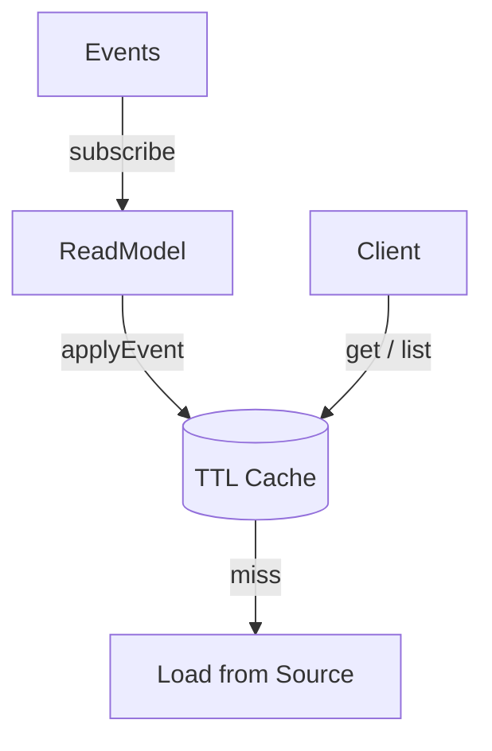
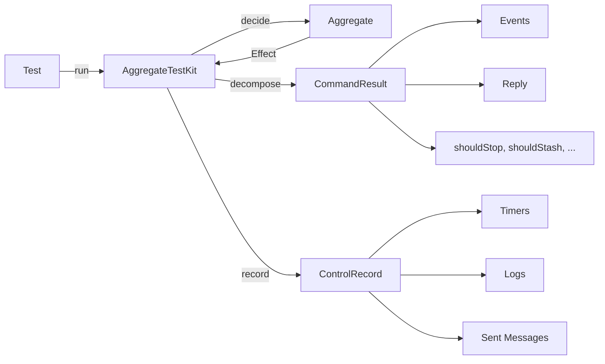

# teob-core

Core abstractions for the TEOB event-sourcing framework. This module defines the execution model and is the only dependency required by all other TEOB modules.

```typescript
import { ... } from "teob-ts/core";
import { ... } from "teob-ts/testing";
```

```
src/core/        — Aggregate, Effect, EffectControl, Codec, Journal, types, ReadModel, Aggregation
src/core/call/   — DurableCall (CallId, RetryPolicy, CircuitBreaker, CallGateway, DurableCallSlot)
src/core/invariant.ts            — Invariant, checkInvariants
src/core/journal-replay-verifier.ts — replayAndVerify, verifyEntity, verifyAll, VerificationReport
src/testing/     — AggregateTestKit, InvariantTestKit (fast-check property-based)
```

## Dependency Graph



---

## Types

Type-safe branded identifiers prevent accidental mixing at compile time:

```typescript
import { EntityId, CategoryId, TimerId, SequenceNr } from "teob-ts/core";

const entityId  = EntityId("user-42");       // branded string
const category  = CategoryId("counter");     // branded string
const timer     = TimerId("reminder");       // branded string
const seq       = SequenceNr(1);             // branded number
const next      = nextSequenceNr(seq);       // SequenceNr(2)
```

---

## Aggregate

The central abstraction. An Aggregate defines pure business logic for an event-sourced entity.



```typescript
interface Aggregate<Command, Reply, Event, State> {
  category: CategoryId;                              // unique category identifier
  initial(id: EntityId): State;                      // initial state factory
  decide(state, command, ctx): Promise<Effect>;       // command handler -> declarative effect
  apply(state, event): State;                        // pure event applicator
  onRecoveryComplete?(state, ctx): Promise<void>;    // hook after event replay
  snapshotEvery?: number;                            // auto-snapshot interval (default: 100)
  invariants?: Invariant<State>[];                   // test-time state predicates
}
```

### Key Rules

- `decide` is async — it may use `EffectControl` for timers, cross-entity communication, external effects, and logging
- `apply` must be **pure** — no side effects, no async, deterministic. This is what gets replayed during recovery
- Domain types (`Command`, `Event`, `Reply`) should be discriminated unions with a `tag` field

### Invariants

Named predicates attached to an Aggregate for test-time verification:

```typescript
const counterAggregate: Aggregate<...> = {
  // ...
  invariants: [
    { name: "value is non-negative", check: (state) => state.value >= 0 },
  ],
};
```

The `testing` module exposes property-based and journal-replay verification for these:

```typescript
import { assertInvariants } from "teob-ts/testing";
import { verifyEntity, verifyAll } from "teob-ts/core";
import * as fc from "fast-check";

// Property-based: generate random command sequences via fast-check.
await assertInvariants({
  aggregate: counterAggregate,
  commandArb: fc.oneof(
    fc.record({ tag: fc.constant("increment"), by: fc.integer({ min: 1, max: 100 }) }),
    fc.record({ tag: fc.constant("decrement"), by: fc.integer({ min: 1, max: 100 }) }),
  ),
  invariants: counterAggregate.invariants!,
  numRuns: 100,
});

// Journal audit: replay a single entity or every entity in the journal.
const entity = await verifyEntity({ journal, aggregate, aggregateId: "u-1", fromOrdinal: 0 });
const report = await verifyAll({ journal, aggregate, fromOrdinal: 0 });
console.log(report.summary());
```

---

## Effect ADT

Effects are declarative descriptions of what the runtime should do after handling a command. They form a chainable tree structure:



### Effect Variants

| Constructor | Description | Terminal? |
|-------------|-------------|-----------|
| `persist(...events)` | Persist one or more events to the journal | No |
| `reply(value)` | Send a reply to the caller immediately | Yes |
| `replyDeferred(deferred)` | Reply later — the caller's `ask()` stays open until `deferred.complete(value)` is called | Yes |
| `run(sideEffect)` | Execute an async side effect | No |
| `snapshot()` | Trigger a state snapshot | No |
| `stop()` | Terminate the entity | Yes |
| `stash()` | Buffer the current command for later | Yes |
| `unstash()` | Resume processing stashed commands | No |
| `done()` | No-op terminal | Yes |

### Chaining Combinators

Non-terminal effects can be chained to compose complex outcomes:

```typescript
import { persist, reply, andReply, andRun, andSnapshot, andStop, andUnstash } from "teob-ts/core";

// Persist events, then reply
andReply(persist({ tag: "Incremented", amount: 5 }), { tag: "Ok" });

// Persist, snapshot, then stop the entity
andStop(andSnapshot(persist({ tag: "Closed" })));

// Persist, run async side effect, then reply
andReply(
  andRun(persist({ tag: "OrderPlaced" }), async () => {
    await sendConfirmationEmail();
  }),
  { tag: "Accepted" },
);

// Persist and resume stashed commands
andUnstash(persist({ tag: "Unlocked" }));
```

### ReplyDeferred — Async Reply Delivery

`Reply` resolves the caller immediately. `ReplyDeferred` keeps the caller's `ask()` open — the reply arrives later when `deferred.complete(value)` is called by a subsequent command.



This is the TypeScript equivalent of Scala TEOB's `Effect.ReplyDeferred(Deferred[F, R])`.

#### DeferredReply Interface

```typescript
import { createDeferredReply, type DeferredReply } from "teob-ts/core";

interface DeferredReply<R> {
  complete(value: R): void;    // resolve the waiting caller
  readonly isCompleted: boolean;
}

// Create a new deferred
const deferred = createDeferredReply<MyReply>();

// Return it as an effect — caller's ask() stays open
return andReplyDeferred(persist(someEvent), deferred);

// Later, in a different command:
deferred.complete({ tag: "Success", data: result });
// → the original ask() resolves
```

#### When to Use

| Pattern | Use `reply()` | Use `replyDeferred()` |
|---------|--------------|----------------------|
| Result known now | Query, validation, sync decision | — |
| Result depends on async side effect | — | External API call, multi-step flow |
| Petri Net flow with `expectsRepliesAt` | Flow completes in one step | Flow requires async transitions |

#### How It Works in the Runtime

1. `decide()` returns `Effect.ReplyDeferred(deferred)` — the runtime sees this and wires `deferred._promise` to the caller's resolve callback
2. The entity continues processing other messages from its mailbox (tellSelf, timers, etc.)
3. When `deferred.complete(value)` is called (from any command handler), the promise resolves and the original caller's `ask()` returns
4. If the deferred is never completed, the existing 30-second timeout at the runtime level resolves the `ask()` with `{ tag: "Timeout" }`
5. `complete()` is idempotent — calling it twice is safe (second call is a no-op)

#### Example: Payment Flow

```typescript
// Store deferreds outside persisted state (in the aggregate factory closure)
function paymentAggregate(): Aggregate<...> {
  const pendingPayments = new Map<string, DeferredReply<PaymentReply>>();

  return {
    category: CategoryId("payment"),
    initial: (id) => ({ id, status: "pending" }),

    async decide(state, command, ctx) {
      switch (command.tag) {
        case "InitiatePayment": {
          const deferred = createDeferredReply<PaymentReply>();
          pendingPayments.set(ctx.entityId, deferred);

          // Kick off the external payment call
          await ctx.sync({
            effect: () => gateway.charge(command.amount),
            onSuccess: (tx) => ({ tag: "PaymentSucceeded", txId: tx.id }),
            onFailure: (err) => ({ tag: "PaymentFailed", reason: err.message }),
          });

          // Caller waits until PaymentSucceeded or PaymentFailed arrives
          return andReplyDeferred(
            persist({ tag: "PaymentInitiated", amount: command.amount }),
            deferred,
          );
        }

        case "PaymentSucceeded": {
          const deferred = pendingPayments.get(ctx.entityId);
          if (deferred && !deferred.isCompleted) {
            deferred.complete({ tag: "Charged", txId: command.txId });
            pendingPayments.delete(ctx.entityId);
          }
          return persist({ tag: "Charged", txId: command.txId });
        }

        case "PaymentFailed": {
          const deferred = pendingPayments.get(ctx.entityId);
          if (deferred && !deferred.isCompleted) {
            deferred.complete({ tag: "Failed", reason: command.reason });
            pendingPayments.delete(ctx.entityId);
          }
          return persist({ tag: "Failed", reason: command.reason });
        }
      }
    },

    apply(state, event) { /* ... */ },
  };
}
```

### Inspection Utilities

```typescript
import { extractEvents, hasReply } from "teob-ts/core";

extractEvents(effect);  // -> Event[]  — collect all events from the chain
hasReply(effect);       // -> boolean  — true for Reply and ReplyDeferred
```

---

## EffectControl

Context available inside command handlers, providing controlled access to the outside world:



### Interface

```typescript
interface EffectControl<Command, Reply> {
  readonly entityId: EntityId;
  readonly categoryId: CategoryId;

  // Self-messaging
  tellSelf(command: Command): Promise<void>;

  // Cross-entity communication (type-safe via CategoryRegistration)
  tell<C, R>(id: EntityId, command: C, cat: CategoryRegistration<C, R>): Promise<void>;
  ask<C, R>(id: EntityId, command: C, cat: CategoryRegistration<C, R>): Promise<Either<ReplyError, R>>;

  // Timers
  scheduleOnce(timerId: TimerId, command: Command, delayMs: number): Promise<void>;
  schedulePeriodic(timerId: TimerId, command: Command, initialDelayMs: number, intervalMs: number): Promise<void>;
  cancelTimer(timerId: TimerId): Promise<void>;

  // Logging
  log(level: "debug" | "info" | "warn" | "error", message: string): void;

  // External effects with callback-based error handling
  sync<Success, Failure>(opts: {
    effect: () => Promise<Either<Failure, Success>>;
    onSuccess: (s: Success) => Command;
    onFailure: (f: Failure) => Command;
    onTimeout?: Command;
    timeoutMs?: number;
  }): Promise<void>;
}
```

### CategoryRegistration

Cross-entity communication uses phantom types for compile-time safety:

```typescript
import { categoryTypes } from "teob-ts/core";

// Register in the target entity's module
export const orderCategory = categoryTypes<OrderCommand, OrderReply>(CategoryId("order"));

// Use in another entity's handler — compiler enforces correct command/reply types
async decide(state, command, ctx) {
  const result = await ctx.ask(EntityId("order-123"), { tag: "GetStatus" }, orderCategory);
  if (result.ok) {
    // result.value is typed as OrderReply
  }
}
```

### Either and ReplyError

```typescript
type Either<L, R> = { ok: true; value: R } | { ok: false; error: L };

type ReplyError =
  | { tag: "Timeout" }
  | { tag: "CategoryNotFound"; categoryId: CategoryId }
  | { tag: "General"; message: string };

// Constructors
right<L, R>(value: R): Either<L, R>
left<L, R>(error: L): Either<L, R>
```

### sync() — External Effects

`sync()` integrates async operations with the entity's command loop by converting results back into commands:

```typescript
async decide(state, command, ctx) {
  await ctx.sync({
    effect: () => callExternalAPI(state.orderId),
    onSuccess: (data) => ({ tag: "PaymentConfirmed", data }),
    onFailure: (err) => ({ tag: "PaymentFailed", reason: err.message }),
    onTimeout: { tag: "PaymentFailed", reason: "timeout" },
    timeoutMs: 5000,
  });
  return done();  // actual processing happens when onSuccess/onFailure command arrives
}
```

### Timers

Timers let an entity schedule commands to itself in the future. When a timer fires, the command arrives in the entity's mailbox as a regular message — processed by `decide` just like any external command.



#### scheduleOnce

Delivers a command to the entity after a delay. The timer is automatically cleaned up after firing. If a timer with the same ID already exists, it is **cancelled and replaced**.

```typescript
async decide(state, command, ctx) {
  switch (command.tag) {
    case "StartCountdown":
      // Send ourselves an Expire command in 5 minutes
      await ctx.scheduleOnce(TimerId("expiry"), { tag: "Expire" }, 5 * 60_000);
      return persist({ tag: "CountdownStarted" });

    case "Expire":
      // This arrives automatically after 5 minutes
      return persist({ tag: "Expired" });
  }
}
```

#### schedulePeriodic

Delivers a command repeatedly at a fixed interval. The first delivery happens after `initialDelayMs`, then every `intervalMs` thereafter. Like `scheduleOnce`, re-scheduling with the same timer ID replaces the existing timer.

```typescript
// Poll for status every 30 seconds, starting immediately
await ctx.schedulePeriodic(
  TimerId("status-poll"),
  { tag: "CheckStatus" },
  0,        // initialDelayMs — fire immediately
  30_000,   // intervalMs — then every 30s
);
```

#### cancelTimer

Cancels a timer by ID. Safe to call even if the timer doesn't exist or has already fired.

```typescript
case "Cancel":
  await ctx.cancelTimer(TimerId("expiry"));
  return persist({ tag: "Cancelled" });
```

#### Semantics

- **Timer IDs are per-entity** — two different entities can use the same timer ID without conflict
- **Re-scheduling replaces** — calling `scheduleOnce` or `schedulePeriodic` with an existing timer ID cancels the old timer before setting the new one. This is the idiomatic way to "reset" a timer (e.g., reset an inactivity timeout on every user action)
- **Cleanup on stop** — all active timers are cancelled when the entity stops (via `Effect.Stop` or runtime shutdown)
- **No persistence** — timers live in memory. After a process restart, in-flight timers are lost. Use `onRecoveryComplete` to re-establish timers if needed
- **Timer commands are regular commands** — they enter the mailbox and are processed sequentially, maintaining the actor's single-command-at-a-time guarantee

#### Common Patterns

**Inactivity timeout** — reset on every activity, fire if idle too long:

```typescript
case "UserAction":
  // Reset the timeout on every action
  await ctx.scheduleOnce(TimerId("idle"), { tag: "IdleTimeout" }, 15 * 60_000);
  return persist({ tag: "ActionRecorded" });

case "IdleTimeout":
  return andStop(persist({ tag: "SessionExpired" }));
```

**Delayed retry** — retry a failed operation after a backoff:

```typescript
case "ProcessingFailed":
  const backoff = Math.min(1000 * Math.pow(2, state.retryCount), 30_000);
  await ctx.scheduleOnce(TimerId("retry"), { tag: "RetryProcessing" }, backoff);
  return persist({ tag: "RetryScheduled", attempt: state.retryCount + 1 });
```

**Periodic heartbeat** — keep-alive or polling:

```typescript
// In onRecoveryComplete — re-establish after restart
onRecoveryComplete: async (state, ctx) => {
  if (state.status === "active") {
    await ctx.schedulePeriodic(TimerId("heartbeat"), { tag: "Heartbeat" }, 0, 60_000);
  }
},
```

---

## Wiring External Dependencies

Aggregates are pure — their `decide` and `apply` functions don't import HTTP clients, databases, or service SDKs. But real applications need to call external APIs, send emails, charge credit cards, and talk to other systems. TEOB provides three complementary mechanisms for bridging the pure domain with the outside world, each suited to a different pattern.

### The Three Mechanisms



| Mechanism | When to Use | Result Feeds Back? | Example |
|-----------|-------------|-------------------|---------|
| `Effect.Run` | Fire-and-forget side effects after events are persisted | No | Send notification, log to analytics, call webhook |
| `ctx.sync()` | External call whose result determines next state change | Yes, as a command | Payment gateway, external validation, API call |
| `ctx.tellSelf()` | Schedule follow-up processing within the entity | Yes, as a command | Trigger next step, retry logic, chain commands |

### Pattern: Aggregate Factory with Dependency Injection

External capabilities are injected into aggregates via **factory functions** that close over their dependencies. The aggregate itself never imports infrastructure — it receives capabilities as function arguments.

```typescript
// --- Define the contract (what the aggregate needs) ---

interface OrderDeps {
  chargeCard: (cardId: string, amount: number) => Promise<{ transactionId: string }>;
  sendReceipt: (email: string, orderId: string) => Promise<void>;
  checkInventory: (sku: string) => Promise<boolean>;
}

// --- Aggregate factory closes over dependencies ---

function orderAggregate(deps: OrderDeps): Aggregate<OrderCommand, OrderReply, OrderEvent, OrderState> {
  return {
    category: CategoryId("order"),
    initial: (id) => ({ id, status: "draft", items: [] }),

    async decide(state, command, ctx) {
      switch (command.tag) {
        case "PlaceOrder": {
          // Use ctx.sync() when the result matters for the next state change
          await ctx.sync({
            effect: async () => {
              const result = await deps.chargeCard(command.cardId, state.total);
              return right(result);
            },
            onSuccess: (result) => ({
              tag: "PaymentConfirmed" as const,
              transactionId: result.transactionId,
            }),
            onFailure: (err) => ({
              tag: "PaymentFailed" as const,
              reason: String(err),
            }),
          });
          return done(); // processing continues when PaymentConfirmed/Failed arrives
        }

        case "PaymentConfirmed":
          // Use Effect.Run for fire-and-forget side effects
          return andRun(
            andReply(
              persist({ tag: "OrderPlaced", transactionId: command.transactionId }),
              { tag: "Ok" },
            ),
            () => deps.sendReceipt(state.customerEmail, state.id),
          );

        case "PaymentFailed":
          return andReply(
            persist({ tag: "OrderRejected", reason: command.reason }),
            { tag: "Rejected", reason: command.reason },
          );
      }
    },

    apply(state, event) { /* pure state transitions */ },
  };
}
```

### Wiring at the Service Level

The factory is called during service setup, typically in the `entities` layer of a `ServiceTemplate`. Real implementations are passed in production; stubs or mocks in tests.

```typescript
// --- Production wiring (in ServiceTemplate.entities) ---

const deps: OrderDeps = {
  chargeCard: (cardId, amount) => stripeClient.charges.create({ cardId, amount }),
  sendReceipt: (email, orderId) => emailService.send({ to: email, template: "receipt", data: { orderId } }),
  checkInventory: (sku) => inventoryAPI.check(sku),
};

const { runtime } = createInMemoryRuntime([
  registration(orderAggregate(deps), orderEventCodec, orderStateCodec),
]);

// --- Test wiring (no infrastructure needed) ---

const testDeps: OrderDeps = {
  chargeCard: async () => ({ transactionId: "test-tx-123" }),
  sendReceipt: async () => {},
  checkInventory: async () => true,
};

const kit = createAggregateTestKit(orderAggregate(testDeps));
```

### Effect.Run vs ctx.sync() — When to Use Which

**`Effect.Run`** executes *after* events are persisted. The side effect is a `() => Promise<void>` — it cannot influence the entity's state. If it fails, the events are already committed. Use it for notifications, analytics, webhooks — things that are important but don't gate the business decision.

```typescript
// Events are persisted first, then the email is sent.
// If the email fails, the order is still placed.
return andRun(
  persist({ tag: "OrderPlaced" }),
  () => sendConfirmationEmail(state.customerEmail),
);
```

**`ctx.sync()`** executes the external call *during* command handling and converts the result back into a new command via `onSuccess`/`onFailure`. The original `decide` call returns `done()` — it doesn't produce events yet. The actual state change happens when the success/failure command arrives. Use it when the external result determines what events to persist.

```typescript
// No events yet — just kick off the external call.
// When it completes, onSuccess/onFailure produces a command
// that arrives back at decide() for the real state change.
await ctx.sync({
  effect: () => paymentGateway.charge(amount),
  onSuccess: (tx) => ({ tag: "ChargeSucceeded", transactionId: tx.id }),
  onFailure: (err) => ({ tag: "ChargeFailed", reason: err.message }),
  timeoutMs: 10_000,
  onTimeout: { tag: "ChargeFailed", reason: "payment gateway timeout" },
});
return done();
```

### Pattern: Chaining Multiple Side Effects

Effects compose — you can chain multiple `Run` steps, each with its own side effect:

```typescript
return andRun(
  andRun(
    andRun(
      persist({ tag: "OrderShipped", trackingId }),
      () => emailService.sendShipmentNotification(state.email, trackingId),
    ),
    () => analyticsService.track("order_shipped", { orderId: state.id }),
  ),
  () => webhookService.notify(state.webhookUrl, { event: "shipped" }),
);
```

Each `Run` executes in sequence after events are persisted. If one fails, subsequent runs still execute (the runtime doesn't short-circuit the chain).

---

## Codec

Manifest-based serialization for events and state:

```typescript
interface Codec<A> {
  manifest(value: A): string;                      // type tag for storage
  encode(value: A): unknown;                       // value -> JSON-serializable
  decode(manifest: string, data: unknown): A;      // reconstruct from storage
}
```

### Built-in Helpers

```typescript
import { tagCodec, objectCodec } from "teob-ts/core";

// For discriminated unions — uses the `tag` field as manifest
const eventCodec = tagCodec<MyEvent>();
// manifest({ tag: "Incremented", amount: 5 }) -> "Incremented"

// For plain objects — single manifest string
const stateCodec = objectCodec<MyState>("MyState");
// manifest({ value: 42 }) -> "MyState"
```

Codecs enable schema evolution — the manifest tells the decoder which shape to expect, allowing versioned decoding logic.

---

## Journal (Store Interface)

The base storage interface for events and snapshots. Defined in core so that both in-memory and PostgreSQL backends can implement it independently:

```typescript
interface Journal {
  persistEvents<E>(categoryId, entityId, events, startSequenceNr, codec): SequenceNr;
  loadEvents<E>(categoryId, entityId, fromSequenceNr, codec): Array<{ sequenceNr; event }>;
  persistSnapshot<S>(categoryId, entityId, state, sequenceNr, codec): void;
  loadSnapshot<S>(categoryId, entityId, codec): { sequenceNr; state } | undefined;
  allEvents<E>(categoryId, codec): Array<{ entityId; sequenceNr; event }>;
}
```

The base methods are synchronous (matching in-memory usage). Async backends like PostgreSQL extend this interface with async variants.

---

## EntityRuntime

Type-erased interface for dispatching commands to entities:

```typescript
interface EntityRuntime {
  tell<C, R>(entityId: EntityId, command: C, cat: CategoryRegistration<C, R>): Promise<void>;
  ask<C, R>(entityId: EntityId, command: C, cat: CategoryRegistration<C, R>): Promise<Either<ReplyError, R | undefined>>;
  categories(): Set<CategoryId>;
  start(): Promise<void>;
  shutdown(): Promise<void>;
}
```

Implementations: [teob-inmem](inmem.md), [teob-postgres](postgres.md).

---

## ReadJournal

Streaming interface for reading persisted events:

```typescript
interface ReadJournal<PersistenceId, Event, Ordinal> {
  fetchIds(since?: Date): AsyncIterable<PersistenceId>;
  lastOrdinal(persistenceId: PersistenceId): Promise<Ordinal>;
  streamIds(): AsyncIterable<PersistenceId>;
  events(persistenceId: PersistenceId, from: Ordinal, to?: Ordinal): AsyncIterable<[Event, Ordinal]>;
}
```

Uses `AsyncIterable` for idiomatic Node.js streaming. The `EntityReadJournal<Event>` convenience alias fixes `PersistenceId = string` and `Ordinal = SequenceNr`.

---

## Aggregation

Generic framework for computing derived state from event streams, with gap detection:



```typescript
interface Consistency<A> {
  consistent(current: A, next: A): boolean;    // next == current + 1
  fromThePast(current: A, next: A): boolean;   // duplicate / already processed
  fromTheFuture(current: A, next: A): boolean; // gap detected
}

// Built-in for numeric sequence numbers
const numberConsistency: Consistency<number>;

// Gap handling strategies
onGapFail()    // throws on gap detection
onGapIgnore()  // silently skips gaps
```

## ReadModel

Cached read-side projection built on top of Aggregation:



```typescript
interface ReadModel<PersistenceId, Event, State, Ordinal>
  extends Aggregation<PersistenceId, Event, Ordinal> {
  get(id: PersistenceId): Promise<State>;
  list(): State[];
  close(): void;  // stop background eviction
}

const model = createReadModel({
  readModelId: "order-summary",
  cacheTtlMs: 60_000,
  getState: (id) => loadOrderSummary(id),
  applyEvent: { apply: (state, event, ordinal) => updateSummary(state, event) },
  onGap: onGapFail(),
  getLastOrdinal: (id) => getLastSequenceNr(id),
  eventHasId: (event) => event.orderId,
  stateHasOrdinal: (state) => state.lastSequenceNr,
  consistency: numberConsistency,
});
```

Cache semantics:
- **Best-effort entries** are overwritten by consistent data but never the reverse
- **TTL-based eviction** runs in background; timer is unref'd to avoid keeping the process alive
- **Metrics hooks** for active entity count, entry lifetime, and apply latency

---

## AggregateTestKit

Synchronous test harness that runs aggregates without a runtime:



### Usage

```typescript
import { createAggregateTestKit } from "teob-ts/testing";

const kit = createAggregateTestKit(counterAggregate);
const state = counterAggregate.initial(EntityId("test"));

// Run command, inspect decomposed effect
const { result, record } = await kit.run(state, { tag: "Increment" });
expect(result.events).toEqual([{ tag: "Incremented" }]);
expect(result.reply).toEqual({ tag: "Count", value: 1 });
expect(result.shouldStop).toBe(false);

// Run and apply events to get new state
const { newState } = await kit.runAndApply(state, { tag: "Increment" });
expect(newState.count).toBe(1);

// Inspect EffectControl interactions
const { record: r } = await kit.run(state, { tag: "ScheduleIncrement", delayMs: 5000 });
expect(r.scheduledTimers).toHaveLength(1);
expect(r.scheduledTimers[0]).toEqual({
  timerId: "auto-inc",
  command: { tag: "Increment" },
  delayMs: 5000,
});
```

### Multi-Step Scenarios

```typescript
let s = counterAggregate.initial(EntityId("test"));

for (let i = 0; i < 5; i++) {
  const { newState } = await kit.runAndApply(s, { tag: "Increment" });
  s = newState;
}
expect(s.count).toBe(5);

const { newState: resetState, result } = await kit.runAndApply(s, { tag: "Reset" });
expect(resetState.count).toBe(0);
expect(result.reply).toEqual({ tag: "Count", value: 0 });
```

### CommandResult

| Field | Type | Description |
|-------|------|-------------|
| `events` | `Event[]` | Events produced by the handler |
| `reply` | `Reply \| undefined` | Immediate reply value, if any |
| `deferredReply` | `DeferredReply<Reply> \| undefined` | Deferred reply — call `complete()` to resolve it later |
| `shouldStop` | `boolean` | Entity should terminate |
| `shouldStash` | `boolean` | Command should be buffered |
| `shouldSnapshot` | `boolean` | Snapshot should be taken |
| `shouldUnstash` | `boolean` | Stashed commands should resume |

### ControlRecord

| Field | Type | Description |
|-------|------|-------------|
| `scheduledTimers` | `Array<{timerId, command, delayMs}>` | Timers scheduled during handling |
| `cancelledTimers` | `string[]` | Timer IDs cancelled |
| `logMessages` | `Array<{level, message}>` | Log messages emitted |
| `selfCommands` | `Command[]` | Commands sent via `tellSelf` |
| `sentMessages` | `Array<{entityId, command}>` | Cross-entity messages sent |

---

## DurableCall

Composable, event-sourced, retry-aware primitive for running external calls (HTTP, RPC, queue publishes) from inside a TEOB aggregate. Every transition is journaled; recovery is idempotent via `CallId`.

```typescript
import { Call } from "teob-ts/core";

// 1. Define the call
const echoCall = Call.DurableCall.of<Req, Resp>({
  name: "echo",
  execute: async (req, callId) => {
    const res = await fetch("https://api.example.com/echo", {
      method: "POST",
      headers: { "Idempotency-Key": callId, "Content-Type": "application/json" },
      body: JSON.stringify(req),
    });
    if (!res.ok) return { ok: false, error: { type: "http_status", code: res.status, body: await res.text() } };
    return { ok: true, value: await res.json() };
  },
  retryPolicy: { maxAttempts: 5, initialDelayMs: 1_000, maxDelayMs: 60_000, strategy: { kind: "fibonacci" } },
});

// 2. Wrap in a gateway with semaphore + circuit breaker
const gateway = Call.CallGateway.create("api", {
  maxConcurrent: 10,
  callTimeoutMs: 30_000,
  circuitBreaker: { maxFailures: 5, resetTimeoutMs: 30_000, halfOpenMaxCalls: 1 },
});

// 3. Inside an aggregate, use a DurableCallSlot
const slot = Call.DurableCallSlot.create({
  call: echoCall,
  gateway,
  timerId: TimerId("echo-retry"),
  getPhase: (s) => s.phase,
  setPhase: (s, p) => ({ ...s, phase: p }),
  getRequest: (s) => s.request,
  wrapEvent: (ev) => ({ tag: "Lifecycle", ev }),
  wrapCallback: (r) => ({ tag: "Callback", result: r }),
  retryCmd: { tag: "Retry" },
  ctx,
});

// In decide(): slot.initiate / slot.handleCallback / slot.handleRetry
// In apply():  slot.applyEvent
// In onRecoveryComplete(): slot.recover  — re-arms timers / re-fires pending calls after a crash
```

**State machine**

```
idle ─ initiate(callId) ─→ pending(attempt=1)
pending(N) ─ success ─→ succeeded
pending(N) ─ retryable, N < maxAttempts ─→ retry_scheduled(N, nextAt)
pending(N) ─ retryable, N = maxAttempts ─→ exhausted
pending(N) ─ non-retryable ─→ permanent_failure
retry_scheduled(N) ─ timer ─→ pending(N+1)
```

**Recovery** — on aggregate boot, `slot.recover(state)` inspects the persisted `CallPhase`:

| Phase | Action |
|---|---|
| `pending` | re-fire with the same `callId` (external system MUST dedupe) |
| `retry_scheduled` | reschedule timer with `max(0, nextAt - now)` |
| terminal | no-op |

**Telemetry** — wrap any `CallGateway` with `instrumentCallGateway` from `teob-ts/telemetry` to emit `teob.call.total`, `teob.call.errors`, `teob.call.duration_ms` and per-call spans. No-op if `@opentelemetry/api` isn't installed.
