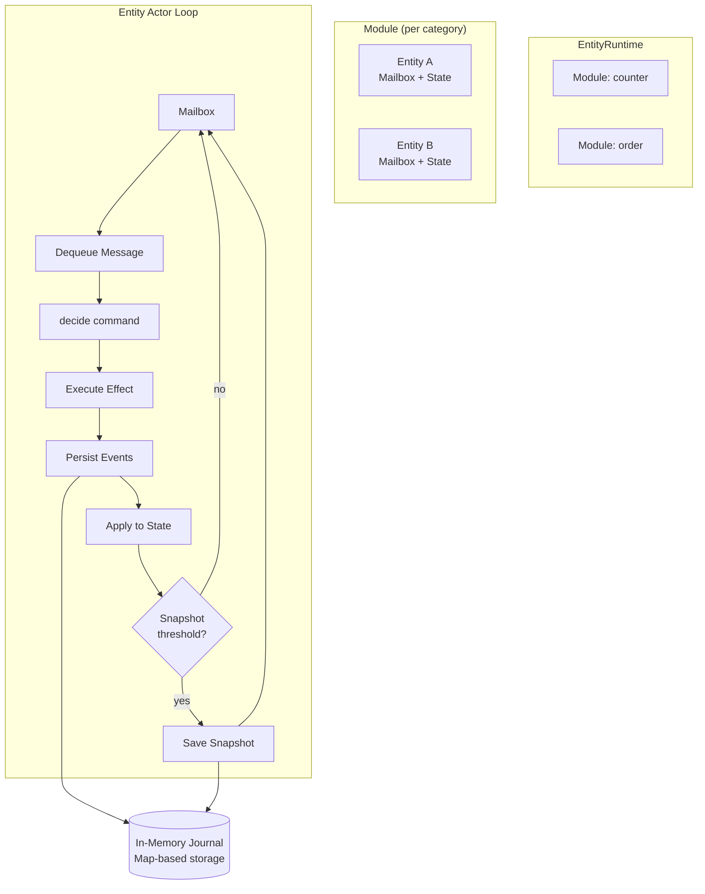
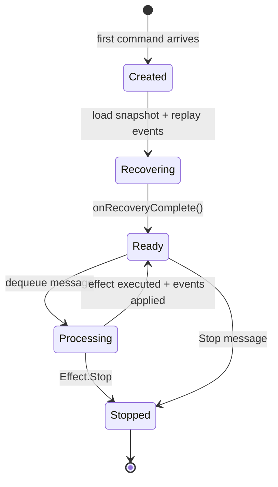
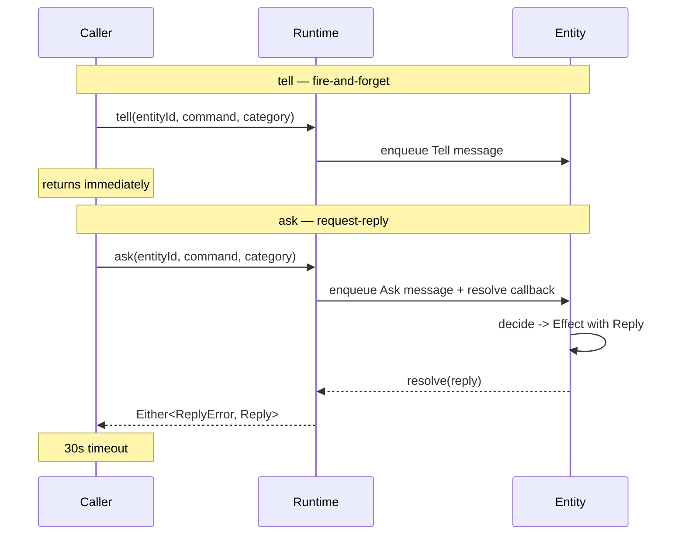

# teob-inmem

In-memory runtime and journal for the TEOB framework. Provides a fully functional `EntityRuntime` backed by in-process state — ideal for testing, development, and single-process deployments.

**Depends on:** [teob-core](core.md)

```typescript
import { createSingleRuntime, createInMemoryRuntime, registration } from "teob-ts/inmem";
```

```
src/inmem/
├── runtime.ts        — createSingleRuntime, createInMemoryRuntime
├── entity-runner.ts  — actor lifecycle, mailbox, recovery
└── journal.ts        — in-memory event/snapshot storage
```

---

## Architecture



Each entity is an independent actor with its own mailbox queue. Entities are created lazily on first command.

---

## API

### createSingleRuntime

Convenience for a single aggregate:

```typescript
import { createSingleRuntime } from "teob-ts/inmem";
import { tagCodec, objectCodec } from "teob-ts/core";

const { runtime, journal } = createSingleRuntime(
  counterAggregate,
  tagCodec<CounterEvent>(),
  objectCodec<CounterState>("CounterState"),
);

await runtime.start();   // entities start lazily — this is a no-op
// ... use runtime.tell() and runtime.ask()
await runtime.shutdown(); // stops all entity actors
```

### createInMemoryRuntime

Multiple aggregates in a shared runtime (enables cross-entity communication):

```typescript
import { createInMemoryRuntime, registration } from "teob-ts/inmem";

const { runtime, journal } = createInMemoryRuntime([
  registration(counterAggregate, counterEventCodec, counterStateCodec),
  registration(orderAggregate, orderEventCodec, orderStateCodec),
]);
```

### AggregateRegistration

Packages an aggregate with its codecs:

```typescript
interface AggregateRegistration<Command, Reply, Event, State> {
  aggregate: Aggregate<Command, Reply, Event, State>;
  eventCodec: Codec<Event>;
  stateCodec: Codec<State>;
}

// Helper
registration(aggregate, eventCodec, stateCodec)
```

---

## Entity Lifecycle



1. **Creation** — First `tell`/`ask` for an entity ID spawns the actor
2. **Recovery** — Load latest snapshot from journal, replay events since snapshot, call `onRecoveryComplete` if defined
3. **Message loop** — Dequeue from mailbox -> `decide(state, command, ctx)` -> execute effect chain -> persist events -> `apply(state, event)` -> auto-snapshot if threshold reached
4. **Timers** — Managed via `setTimeout`/`setInterval`, automatically cancelled on entity stop
5. **Shutdown** — Send `Stop` to all actors, await completion

---

## tell vs ask



- `tell` returns `Promise<void>` — the command is enqueued but the caller does not wait for processing
- `ask` returns `Promise<Either<ReplyError, R>>` — the caller awaits the reply with a 30-second timeout
- If the aggregate returns `ReplyDeferred(deferred)` instead of `Reply(value)`, the `ask()` stays open across multiple command processings until `deferred.complete(value)` is called — the caller sees the same `Either<ReplyError, R>` interface regardless

---

## In-Memory Journal

Simple `Map`-based storage:

```typescript
interface Journal {
  persistEvents(persistenceId: string, events: JournalEntry[]): Promise<void>;
  loadEvents(persistenceId: string, fromSeqNr: number): Promise<JournalEntry[]>;
  persistSnapshot(persistenceId: string, snapshot: SnapshotEntry): Promise<void>;
  loadSnapshot(persistenceId: string): Promise<SnapshotEntry | undefined>;
}
```

- Events stored as arrays keyed by `persistenceId`
- Snapshots stored as single entries per `persistenceId` (latest wins)
- No durability — data is lost on process exit
- Returned by `createSingleRuntime` / `createInMemoryRuntime` for inspection in tests
