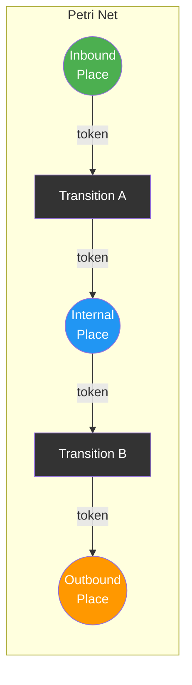
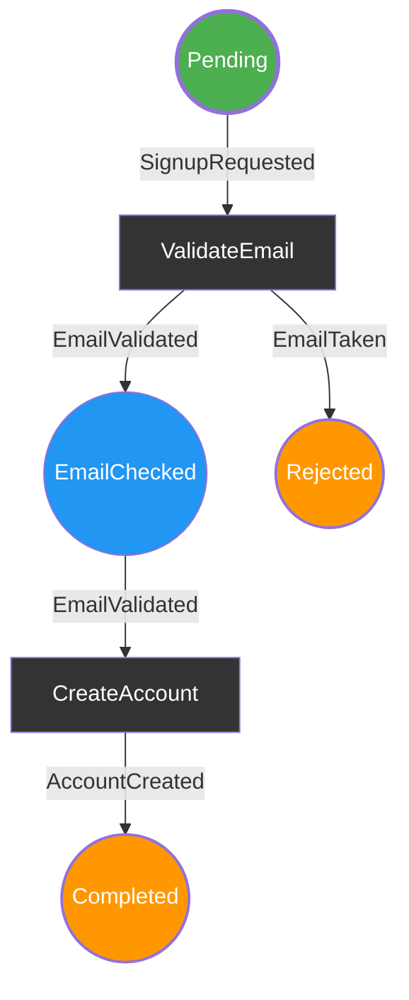
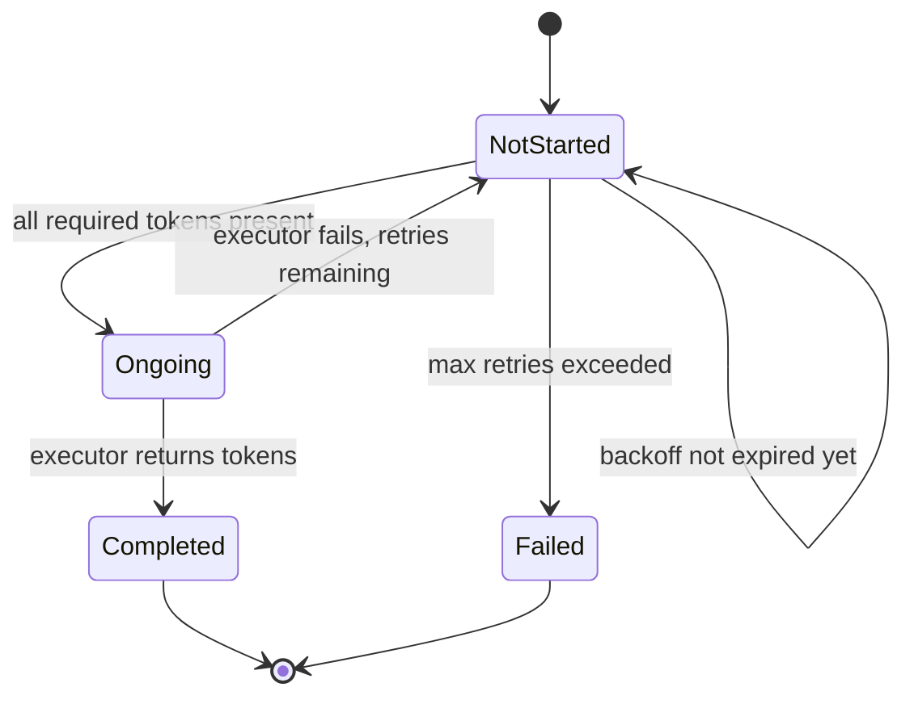
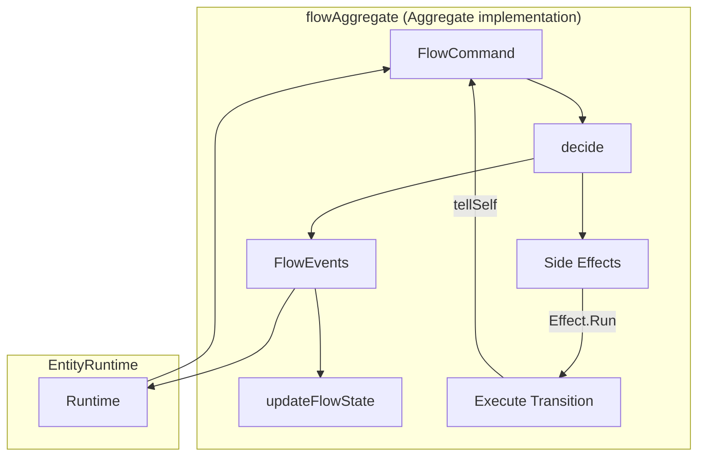
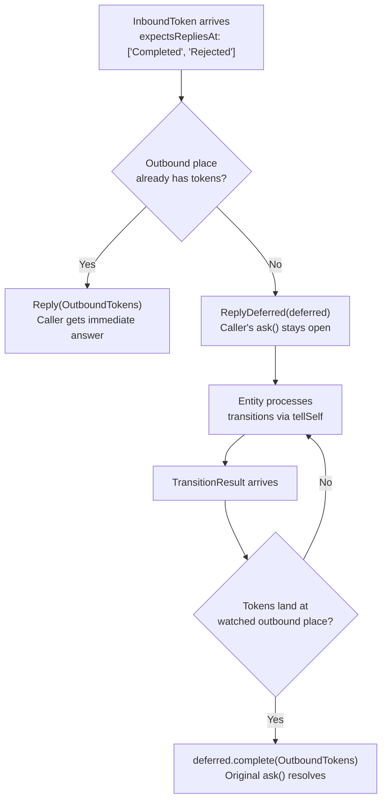
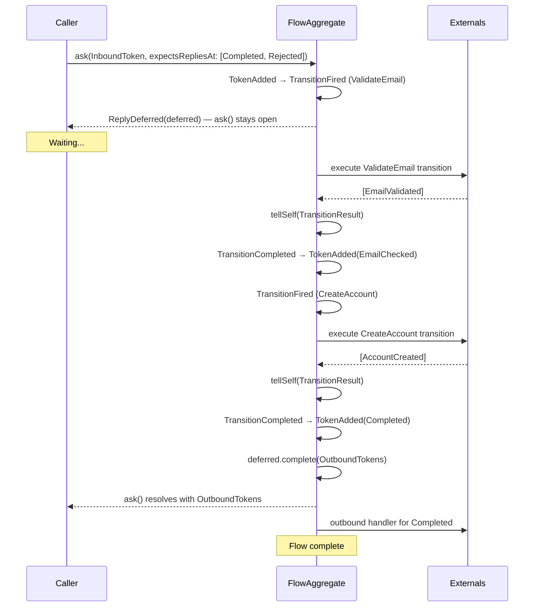

# teob-petrinet

Flow-based state machines modeled as Petri Nets, with automatic transition firing, retry with Fibonacci backoff, and seamless TEOB integration via `flowAggregate`.

**Depends on:** [teob-core](core.md)

```typescript
import { flowSchema, flowAggregate, compileSchemaOrFail, placeDef, transitionDef } from "teob-ts/petrinet";
```

```
src/petrinet/
├── types.ts            — Token, PlaceDef, TransitionDef, PlaceType, TransitionState
├── flow-schema.ts      — flowSchema, validate, compileSchema, compileSchemaOrFail
├── executable-flow.ts  — ExecutableFlow, token operations, transition lifecycle
└── flow-aggregate.ts   — flowAggregate, FlowCommand, FlowEvent, FlowState, FlowExternals
```

---

## Concepts



| Concept | Description |
|---------|-------------|
| **Token** | Data flowing through the net. Any object with a `tag: string` discriminator |
| **Place** | Holds tokens. Types: **Inbound** (entry point), **Internal** (intermediate), **Outbound** (exit point) |
| **Transition** | Consumes tokens from a source place, executes logic, produces tokens to destinations |
| **Flow Schema** | Static structure definition — places, transitions, and their connections |
| **Executable Flow** | Runtime state: current tokens in places, transition states, retry counters |

---

## Defining a Flow

### 1. Token Types

```typescript
import type { Token } from "teob-ts/petrinet";

interface SignupRequested extends Token { tag: "SignupRequested"; email: string; password: string }
interface EmailValidated extends Token { tag: "EmailValidated"; email: string }
interface AccountCreated extends Token { tag: "AccountCreated"; userId: string }
interface EmailTaken    extends Token { tag: "EmailTaken";    email: string }
```

### 2. Places

```typescript
import { placeDef } from "teob-ts/petrinet";

const Pending      = placeDef("Pending",      ["SignupRequested"], "Inbound");
const EmailChecked = placeDef("EmailChecked",  ["EmailValidated"],  "Internal");
const Completed    = placeDef("Completed",     ["AccountCreated"],  "Outbound");
const Rejected     = placeDef("Rejected",      ["EmailTaken"],      "Outbound");
```

Each place declares which token tags it accepts. The framework enforces this at runtime — tokens with non-matching tags are silently rejected.

### 3. Transitions

```typescript
import { transitionDef } from "teob-ts/petrinet";

// source place -> consumed token tags -> { produced tag: destination place }
const ValidateEmail = transitionDef("ValidateEmail", "Pending", ["SignupRequested"], {
  EmailValidated: "EmailChecked",
  EmailTaken: "Rejected",
});

const CreateAccount = transitionDef("CreateAccount", "EmailChecked", ["EmailValidated"], {
  AccountCreated: "Completed",
});
```

### 4. Schema and Compilation

```typescript
import { flowSchema, compileSchemaOrFail } from "teob-ts/petrinet";

const schema = flowSchema(
  [Pending, EmailChecked, Completed, Rejected],
  [ValidateEmail, CreateAccount],
);

const flow = compileSchemaOrFail(schema, "SignupFlow");
// Options: compileSchemaOrFail(schema, "SignupFlow", { maxTransitionRetries: 5 })
```

### Resulting Flow



---

## Schema Validation

`validate(schema)` performs comprehensive soundness checks:

| Check | Description |
|-------|-------------|
| No duplicate IDs | Place and transition IDs must be unique |
| Valid references | Transition source/destination places must exist |
| Token type compatibility | Produced token tags must be accepted by destination places |
| No unused nodes | Every place and transition must participate in the flow |
| Inbound/Outbound | Exactly 1 Inbound place, at least 1 Outbound place |
| Connectivity | All nodes reachable from Inbound |
| Directed soundness | All nodes lie on a path from Inbound to some Outbound |
| No token gaps | Token types flow consistently through the graph |

`compileSchema` returns errors as data; `compileSchemaOrFail` throws on validation failure.

---

## Executable Flow — Token Operations

```typescript
import { addToken, addTokens, withInitialTokens, transitionsReady,
         recordTransitionStart, recordTransitionCompletion, recordTransitionFailure,
         placeForResult, toDotString } from "teob-ts/petrinet";

// Add a token to a place (rejects if tag not accepted)
const flow1 = addToken(flow, "Pending", { tag: "SignupRequested", email: "a@b.com", password: "p" });

// Find transitions with all required tokens present
const ready = transitionsReady(flow1);
// -> [[transitionInstance, consumedTokens], ...]

// Transition lifecycle
const flow2 = recordTransitionStart(flow1, "Pending", "ValidateEmail");
// -> tokens consumed, transition marked "Ongoing"

const flow3 = recordTransitionCompletion(flow2, "ValidateEmail", tokensByPlace, spanId);
// -> produced tokens placed at destinations, transition marked "Completed"

const flow4 = recordTransitionFailure(flow2, "ValidateEmail", "Pending");
// -> consumed tokens returned to source, retry counter incremented
```

### DOT Visualization

```typescript
const dot = toDotString(flow);
// Generates Graphviz DOT string
// - Inbound places: thick border
// - Places with tokens: yellow fill
// - Transitions: rectangular nodes
```

---

## Transition Lifecycle



- **Automatic firing** — When all required tokens are present and backoff has expired, the transition fires
- **Fibonacci backoff** — Retry delays: 1s, 1s, 2s, 3s, 5s, 8s, 13s, ...
- **Max retries** — Configurable via `compileSchemaOrFail(schema, id, { maxTransitionRetries: N })`
- **Token safety** — On failure, consumed tokens are returned to the source place

---

## FlowAggregate — TEOB Integration

`flowAggregate` wraps a Petri Net as a standard TEOB `Aggregate`, making it runnable in any `EntityRuntime`:



### FlowExternals

Define what each transition does and what happens when tokens reach outbound places:

```typescript
interface FlowExternals {
  transitions: Map<string, TransitionExecutor>;
  outbound: Map<string, OutboundHandler>;
}

// TransitionExecutor: (transitionId, consumedTokens) => Token[] | { error: string }
// OutboundHandler:    (placeId, token) => void
```

### Example

```typescript
import { flowAggregate } from "teob-ts/petrinet";
import { createSingleRuntime } from "teob-ts/inmem";

const aggregate = flowAggregate({
  category: CategoryId("signup-flow"),
  initialFlow: () => compileSchemaOrFail(schema, "SignupFlow"),
  externals: {
    transitions: new Map([
      ["ValidateEmail", async (_tid, consumed) => {
        const req = consumed.find(t => t.tag === "SignupRequested");
        if (await isEmailAvailable(req.email)) {
          return [{ tag: "EmailValidated", email: req.email }];
        }
        return [{ tag: "EmailTaken", email: req.email }];
      }],
      ["CreateAccount", async (_tid, consumed) => {
        const v = consumed.find(t => t.tag === "EmailValidated");
        const userId = await createUser(v.email);
        return [{ tag: "AccountCreated", userId, email: v.email }];
      }],
    ]),
    outbound: new Map([
      ["Completed", async (_pid, token) => { await sendWelcomeEmail(token); }],
      ["Rejected",  async (_pid, token) => { await logRejection(token); }],
    ]),
  },
});

// Run in any TEOB runtime
const { runtime } = createSingleRuntime(aggregate, tagCodec(), objectCodec("FlowState"));
await runtime.start();

// Fire-and-forget — caller doesn't wait for flow completion
await runtime.tell(EntityId("signup-1"), {
  tag: "InboundToken",
  token: { tag: "SignupRequested", email: "alice@example.com", password: "s3cret" },
  expectsRepliesAt: [],
  spanId: "span-1",
}, flowCategory);

// Poll for state later
const view = await runtime.ask(EntityId("signup-1"), { tag: "GetFlowInstanceView" }, flowCategory);

// OR: Synchronous wait — caller blocks until flow reaches an outbound place
const result = await runtime.ask(EntityId("signup-2"), {
  tag: "InboundToken",
  token: { tag: "SignupRequested", email: "bob@example.com", password: "s3cret" },
  expectsRepliesAt: ["Completed", "Rejected"],  // wait for either outcome
  spanId: "span-2",
}, flowCategory);
// result.value is OutboundTokens with the tokens at whichever outbound place was reached
```

---

## Flow Commands and Events

### Commands

| Command | Description |
|---------|-------------|
| `InboundToken` | Inject a token at the inbound place. Fields: `token`, `expectsRepliesAt`, `spanId` |
| `GetFlowInstanceView` | Query current flow state — returns place tokens and transition states |
| `TransitionResult` | *Internal* — result from executed transition (fed back via `tellSelf`) |
| `TransitionError` | *Internal* — transition execution failed |

**`expectsRepliesAt`** controls how the caller receives the flow outcome:
- **Empty array** (`[]`): fire-and-forget — `tell()` or `ask()` returns immediately, caller polls with `GetFlowInstanceView`
- **Place IDs** (`["Completed", "Rejected"]`): the caller's `ask()` stays open (via `ReplyDeferred`) until tokens land at one of the specified outbound places. If the flow completes synchronously within the first `decide` call, the reply is immediate; if it requires async transitions (the common case), a deferred reply is created and completed when the outbound tokens arrive.

### Events

| Event | Description |
|-------|-------------|
| `TokenAdded` | Token placed at a place. Fields: `placeId`, `token`, `spanId` |
| `TransitionFired` | Transition started, tokens consumed. Fields: `transitionId`, `from`, `consumed`, `spanId` |
| `TransitionCompleted` | Transition succeeded, tokens produced. Fields: `transitionId`, `to`, `spanId` |
| `TransitionFailed` | Transition failed, tokens returned. Fields: `transitionId`, `from`, `spanId` |

### Reply

| Reply | Description |
|-------|-------------|
| `FlowInstanceView` | Current state: `places` (Map of place -> tokens), `transitions` (Map of id -> state) |
| `TokenRejected` | Token was not accepted by any inbound place |
| `OutboundTokens` | Outbound tokens reply — returned when tokens reach a place listed in `expectsRepliesAt`. Delivered either immediately (sync path) or via `ReplyDeferred` (async path) |

---

## Deferred Reply Mechanics

When `InboundToken` is sent via `ask()` with `expectsRepliesAt`, the flow aggregate decides between two paths:



The pending deferreds are stored in a transient map in the aggregate factory closure (not in persisted state). They are keyed by `entityId:spanId` so multiple concurrent flows can each have their own deferred. If a deferred is never completed, the runtime's 30-second ask timeout provides the safety net.

---

## End-to-End Flow


