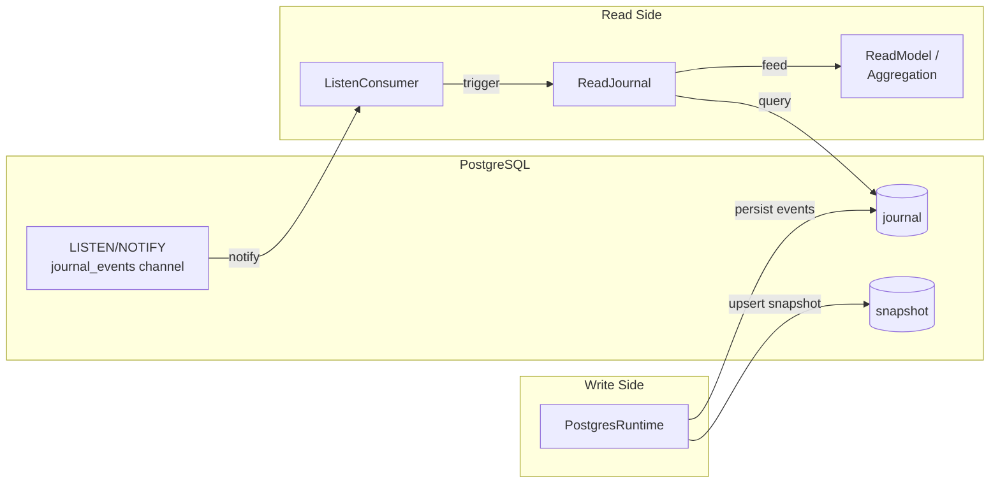
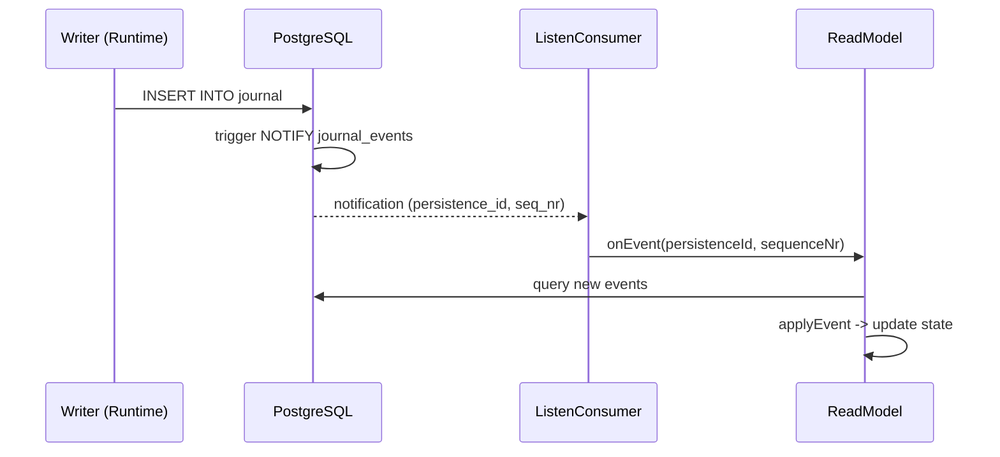

# teob-postgres

PostgreSQL-backed runtime and journal for the TEOB framework. Production-grade persistence with transactional event storage, UPSERT snapshots, and real-time event streaming via LISTEN/NOTIFY.

**Depends on:** [teob-core](core.md)

```typescript
import { createPostgresJournal, createPostgresRuntime, pgRegistration } from "teob-ts/postgres";
```

```
src/postgres/
├── runtime.ts       — createPostgresRuntime
├── journal.ts       — createPostgresJournal, schema migration
├── config.ts        — PostgresConfig, postgresConfigFromEnv
├── listen.ts        — LISTEN/NOTIFY consumer with auto-reconnect
├── read-journal.ts  — ReadJournal implementation
├── retry.ts         — retry logic with exponential backoff
└── clean-journal.ts — journal maintenance utilities
```

---

## Architecture



---

## Configuration

```typescript
import { postgresConfigFromEnv } from "teob-ts/postgres";

const config = postgresConfigFromEnv();
```

Environment variables:

| Variable | Default | Description |
|----------|---------|-------------|
| `PGHOST` | `localhost` | PostgreSQL host |
| `PGPORT` | `5432` | PostgreSQL port |
| `PGUSER` | `postgres` | Database user |
| `PGPASSWORD` | `postgres` | Database password |
| `PGDATABASE` | `teob` | Database name |

---

## Journal

### Schema

**journal table:**

| Column | Type | Description |
|--------|------|-------------|
| `persistence_id` | text | Entity category + id |
| `sequence_nr` | bigint | Monotonic event sequence number |
| `timestamp` | bigint | Event timestamp (epoch ms) |
| `event` | jsonb | Serialized event payload |
| `event_manifest` | text | Codec manifest (type tag) |
| `serializer_id` | text | Serializer identifier |
| `writer_uuid` | text | Writer identifier |

**snapshot table:**

| Column | Type | Description |
|--------|------|-------------|
| `persistence_id` | text | Entity category + id |
| `sequence_nr` | bigint | Sequence number at snapshot |
| `timestamp` | bigint | Snapshot timestamp (epoch ms) |
| `snapshot` | jsonb | Serialized state |
| `snapshot_manifest` | text | Codec manifest |
| `serializer_id` | text | Serializer identifier |

### Usage

```typescript
import { createPostgresJournal } from "teob-ts/postgres";

const journal = createPostgresJournal(config);
await journal.migrate();  // create tables if not exist

// Journal operations
await journal.persistEventsAsync(persistenceId, events);     // batch insert with transaction
await journal.loadEventsAsync(persistenceId, fromSeqNr);     // query events by range
await journal.persistSnapshotAsync(persistenceId, snapshot); // UPSERT (ON CONFLICT)
await journal.loadSnapshotAsync(persistenceId);              // fetch latest
await journal.highestSequenceNr(persistenceId);
await journal.fetchPersistenceIds();
await journal.deleteEvents(persistenceId, toSeqNr);
await journal.deleteSnapshots(persistenceId);
```

---

## Runtime

Same actor-based execution model as [teob-inmem](inmem.md), but with PostgreSQL-backed persistence:

```typescript
import { createPostgresRuntime, pgRegistration } from "teob-ts/postgres";

const runtime = createPostgresRuntime(journal, [
  pgRegistration(counterAggregate, counterEventCodec, counterStateCodec),
  pgRegistration(orderAggregate, orderEventCodec, orderStateCodec),
]);

await runtime.start();
// ... use runtime.tell() and runtime.ask()
await runtime.shutdown();
```

Recovery loads snapshots and replays events from PostgreSQL. Auto-snapshotting persists state at the configured interval.

---

## LISTEN/NOTIFY Consumer

Subscribe to real-time event notifications for building read-side projections:



```typescript
import { createListenConsumer } from "teob-ts/postgres";

const consumer = createListenConsumer(config, {
  onEvent: (persistenceId, sequenceNr) => {
    // React to new events — trigger read model update, etc.
  },
});

await consumer.start();
```

### Resilience

- **Silence detection** — If no notifications arrive within 5 seconds, the consumer assumes the connection may be stale
- **Auto-reconnect** — On connection loss, reconnects with a 10-second cooldown to avoid thundering herd
- **Dedicated connection** — Uses a separate PostgreSQL connection from the connection pool to avoid blocking queries

---

## Retry Logic

Configurable retry with exponential backoff for transient failures:

```typescript
import { withRetry } from "teob-ts/postgres";

const result = await withRetry(
  () => someAsyncOperation(),
  { maxRetries: 3, baseDelayMs: 100 },
);
```

---

## Running Locally

```bash
docker compose up -d     # Start PostgreSQL
pnpm test                 # PostgreSQL tests auto-detect connection
```
