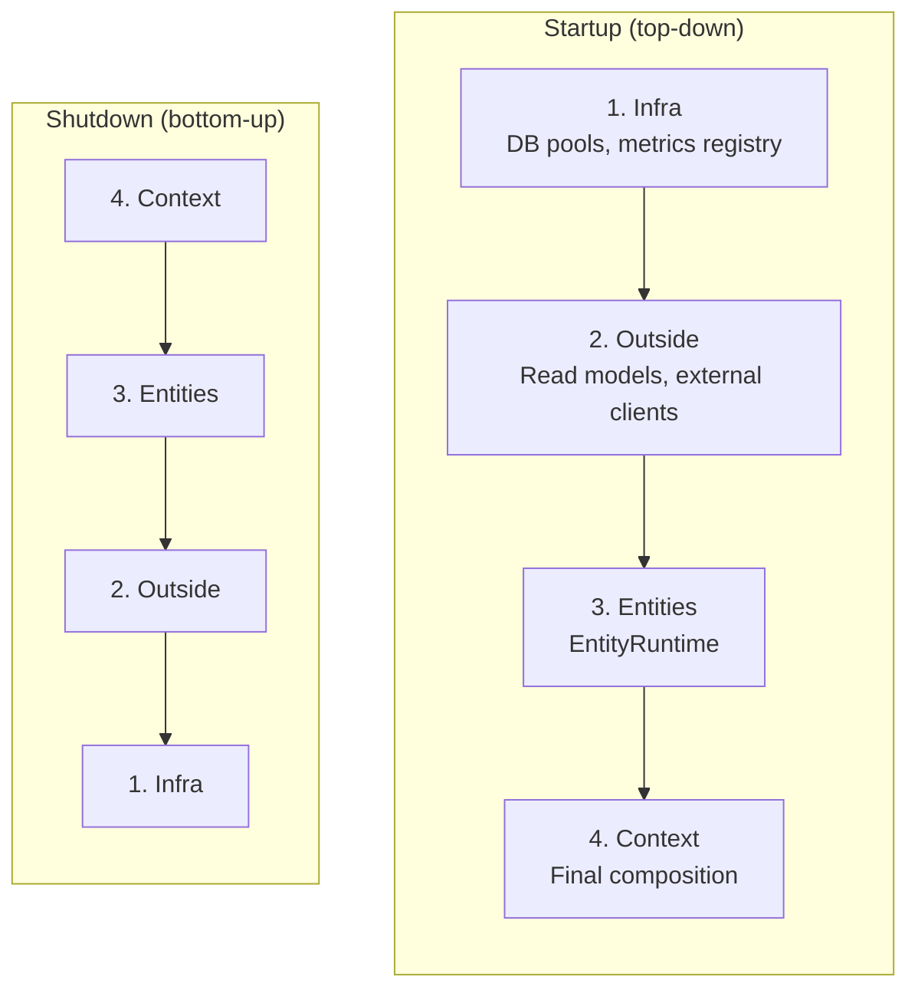
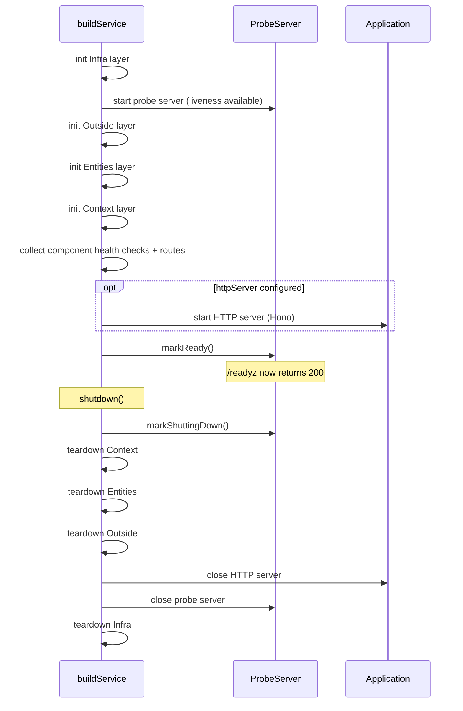

# teob-service

Layered service lifecycle management with health checks, probe server, and structured startup/shutdown. Provides a production-ready service harness for TEOB applications.

**Standalone module** — no TEOB core dependency.

```typescript
import { buildService, simpleHealthCheck, HealthStatus } from "teob-ts/service";
```

```
src/service/
├── service-template.ts  — ServiceTemplate, buildService
├── health-check.ts      — HealthCheck, HealthStatus, aggregation
├── lifecycle.ts         — structured lifecycle logging
└── probe-server.ts      — liveness/readiness HTTP endpoints
```

---

## Service Lifecycle



Each layer receives the outputs of all previous layers. Teardown functions are called in **reverse** order, ensuring that infrastructure outlives the components that depend on it.

---

## ServiceTemplate

```typescript
interface ServiceTemplate<Infra, Outside, Entities, Context> {
  config?: ServiceConfig;

  // Layer initialization (top-down)
  infra(): Promise<Infra>;
  outside(infra: Infra): Promise<Outside>;
  entities(infra: Infra, outside: Outside): Promise<Entities>;
  context(infra: Infra, outside: Outside, entities: Entities): Promise<Context>;

  // Health checks and routes
  componentExports?(infra, outside, entities, context): ComponentExports;
  infraHealthChecks?(infra: Infra): HealthCheck[];
  metricsExporter?(infra: Infra): () => Promise<string>;

  // Layer teardown (called in reverse order)
  teardownInfra?(infra: Infra): Promise<void>;
  teardownOutside?(outside: Outside): Promise<void>;
  teardownEntities?(entities: Entities): Promise<void>;
  teardownContext?(context: Context): Promise<void>;
}
```

### Example

```typescript
import { buildService } from "teob-ts/service";
import { simpleHealthCheck, HealthStatus } from "teob-ts/service";

const service = await buildService({
  config: {
    probeServer: { host: "0.0.0.0", port: 9090 },
    httpServer: { host: "0.0.0.0", port: 8080 },
  },

  async infra() {
    const journal = createPostgresJournal(config);
    await journal.migrate();
    return { journal };
  },

  async outside(infra) {
    return {};  // read models, external API clients
  },

  async entities(infra, outside) {
    return createPostgresRuntime(infra.journal, registrations);
  },

  async context(infra, outside, entities) {
    return { runtime: entities };
  },

  infraHealthChecks(infra) {
    return [simpleHealthCheck("postgres", async () => {
      await infra.journal.ping();
      return HealthStatus.Healthy;
    })];
  },

  async teardownEntities(entities) {
    await entities.shutdown();
  },

  async teardownInfra(infra) {
    await infra.journal.close();
  },
});
```

### RunningService

```typescript
interface RunningService<Context> {
  context: Context;                    // the composed application context
  probeControl: ProbeServerControl;    // liveness/readiness control
  shutdown(): Promise<void>;           // graceful teardown in reverse layer order
}
```

---

## buildService Sequence



---

## Health Checks

```typescript
import { HealthStatus, simpleHealthCheck, aggregateHealth } from "teob-ts/service";

// HealthStatus is a tagged union with helper constructors:
type HealthStatus =
  | { tag: "Healthy" }
  | { tag: "Unhealthy"; reason: string }
  | { tag: "Degraded"; reason: string }
  | { tag: "Unknown"; reason: string };

// Constructors
HealthStatus.Healthy                         // { tag: "Healthy" }
HealthStatus.Unhealthy("connection refused") // { tag: "Unhealthy", reason: "..." }
HealthStatus.Degraded("high latency")        // { tag: "Degraded", reason: "..." }
HealthStatus.Unknown("check timed out")      // { tag: "Unknown", reason: "..." }

// Utilities
HealthStatus.isHealthy(status)    // true for Healthy or Degraded
HealthStatus.isReady(status)      // true for Healthy or Degraded
HealthStatus.combine(statuses)    // worst status wins: Unhealthy > Unknown > Degraded > Healthy
HealthStatus.label(status)        // "healthy" | "unhealthy" | "degraded" | "unknown"

// Simple check
const dbCheck = simpleHealthCheck("database", async () => {
  return isConnected ? HealthStatus.Healthy : HealthStatus.Unhealthy("connection lost");
});

// Aggregate multiple checks — worst status wins
const overall = await aggregateHealth([dbCheck, cacheCheck, queueCheck]);
```

Each `HealthCheckResult` includes the check name, status, latency, and timestamp.

---

## Probe Server

Started immediately after the Infra layer — available even while the rest of the service is still initializing:

| Endpoint | Purpose | Initial Response |
|----------|---------|------------------|
| `/healthz` | **Liveness** — is the process alive? | 200 |
| `/readyz` | **Readiness** — ready for traffic? | 503 until `markReady()` |
| `/metrics` | Optional Prometheus metrics export | Requires `metricsExporter` |

```typescript
interface ProbeServerControl {
  markReady(): void;
  markShuttingDown(): void;
  close(): Promise<void>;
}
```

---

## HTTP Server

The service template optionally starts an HTTP server (Hono) for application routes:

```typescript
const service = await buildService({
  config: {
    httpServer: { host: "0.0.0.0", port: 8080 },
    // ...
  },

  componentExports(infra, outside, entities, context) {
    const app = new Hono();
    app.get("/api/counters/:id", async (c) => {
      // ...
    });
    return { healthChecks: [], routes: app };
  },

  // ...
});
```

The HTTP server is separate from the probe server — it starts only after all layers are initialized and is shut down before layer teardown begins.

---

## SlackClient

Minimal Slack Web API client for posting messages, replying in threads, updating, and reacting. Pure HTTP + bearer token; no SDK dependency.

```typescript
import { SlackClient } from "teob-ts/service";

const slack = new SlackClient({ botToken: process.env.SLACK_BOT_TOKEN! });

// Post a message; returns the message ts on success
const ts = await slack.postMessage("#alerts", "Build failed on main");

// Reply in thread
await slack.postMessage("#alerts", "...details", ts);

// Update a previous message
await slack.updateMessage("#alerts", ts!, "Build recovered");

// Ephemeral message visible only to one user
await slack.postEphemeral("#alerts", "U123ABC", "Heads up: your fix needs review");

// React with an emoji
await slack.addReaction("#alerts", ts!, "thumbsup");

// Verify the bot token works
const info = await slack.authTest();
```

Public methods return `string | undefined` (for `ts`) or `boolean` (for the rest); errors are logged and swallowed so callers don't need structured error handling. Pass `fetch` through `SlackClientOpts.fetch` to inject a mock for tests.
